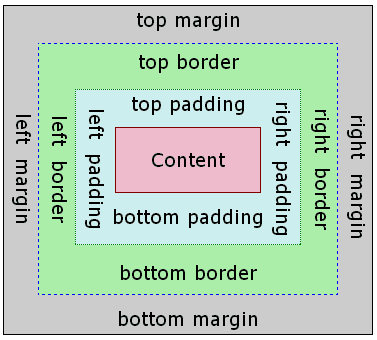

# 盒子模型

## 简介

页面布局的盒模型基于 [CSS 盒模型](https://developer.mozilla.org/zh-CN/docs/Web/CSS/CSS_Box_Model/Introduction_to_the_CSS_box_model?spm=a2c7j.-zh-docs-styles-common-styles.0.0.3f9560fdvh2hYM)，每个 组件元素都可视作一个盒子。我们一般在讨论设计或布局时，会提到「盒模型」这个概念。



盒模型描述了一个元素所占用的空间。每一个盒子有四条边界：外边距边界 margin edge, 边框边界 border edge, 内边距边界 padding edge 与内容边界 content edge。这四层边界，形成一层层的盒子包裹起来，这就是盒模型大体上的含义。

**盒模型的 box-sizing 默认为 border-box**，即盒子的宽高包含内容、内边距和边框的宽度，不包含外边距的宽度。

默认是 `overflow:hidden`

下面的例子显示了盒模型的基本用法

```html
<template>
  <div>
    <image src="..." style="width: 400; height: 200; margin-left: 20;"></image>
  </div>
</template>
```

## 宽度

`width {length}`：默认值 0

## 高度

`height {length}`：默认值 0

## 内边距

`padding {length}`：内边距，内容和边框之间的距离，默认值 0。与标准 CSS 类似，`padding` 支持简写，也可分解为以下四个：

- `padding {length}`: 上、下、左、右四边内边距，默认值 0
- `padding-left {length}`：左内边距，默认值 0
- `padding-right {length}`：右内边距，默认值 0
- `padding-top {length}`：上内边距，默认值 0
- `padding-bottom {length}`：下内边距，默认值 0

## 边框

### border-style

`border-style`设定边框样式，如果四个方向的边框样式不同，可分别设置：

- `border-style {string}`
- `border-left-style {string}`：可选值为 `solid` | `dashed` | `dotted`，默认值 `solid`
- `border-top-style {string}`：可选值为 `solid` | `dashed` | `dotted`，默认值 `solid`
- `border-right-style {string}`：可选值为 `solid` | `dashed` | `dotted`，默认值 `solid`
- `border-bottom-style {string}`：可选值为 `solid` | `dashed` | `dotted`，默认值 `solid`

支持的值如下：

- `solid`：实线边框，默认值 `solid`
- `dashed`：方形虚线边框
- `dotted`：圆点虚线边框

### border-width

`border-width`：设定边框宽度，非负值, 默认值 0，如果四个方向的边框宽度不同，可分别设置：

- `border-width {length}`：非负值, 默认值 0
- `border-left-width {length}`：非负值, 默认值 0
- `border-top-width {length}`：非负值, 默认值 0
- `border-right-width {length}`：非负值, 默认值 0
- `border-bottom-width {length}`：非负值, 默认值 0

### border-color

`border-color`：设定边框颜色，默认值 `#000000`，如果四个方向的边框颜色不同，可分别设置：

- `border-color {color}`：默认值 `#000000`
- `border-left-color {color}`：默认值 `#000000`
- `border-top-color {color}`：默认值 `#000000`
- `border-right-color {color}`：默认值 `#000000`
- `border-bottom-color {color}`：默认值 `#000000`

### border-radius

`border-radius`：设置边框的圆角，默认值 0，如果四个方向的圆角弧度不同，可分别设置：

- `border-radius {length}`: 非负值, 默认值 0
- `border-bottom-left-radius {length}`：非负值, 默认值 0
- `border-bottom-right-radius {length}`：非负值, 默认值 0
- `border-top-left-radius {length}`：非负值, 默认值 0
- `border-top-right-radius {length}`：非负值, 默认值 0

WARNING

`border-radius`和`border-width`定义了圆心角为90度的椭圆弧的长轴和半长轴的大小。如果邻接两边`border-radius`(或`border-width`不一致，页面绘制的边框曲线可能不够平滑。

## 外边距

`margin {length}`：外边距，元素和元素之间的空白距离，默认值 0。与标准 CSS 类似，`margin` 支持简写，也可分解为四边：

- `margin {length}`: 上、下、左、右四边外边距，默认值 0
- `margin-left {length}`：左外边距，默认值 0
- `margin-right {length}`：右外边距，默认值 0
- `margin-top {length}`：上外边距，默认值 0
- `margin-bottom {length}`：下外边距，默认值 0