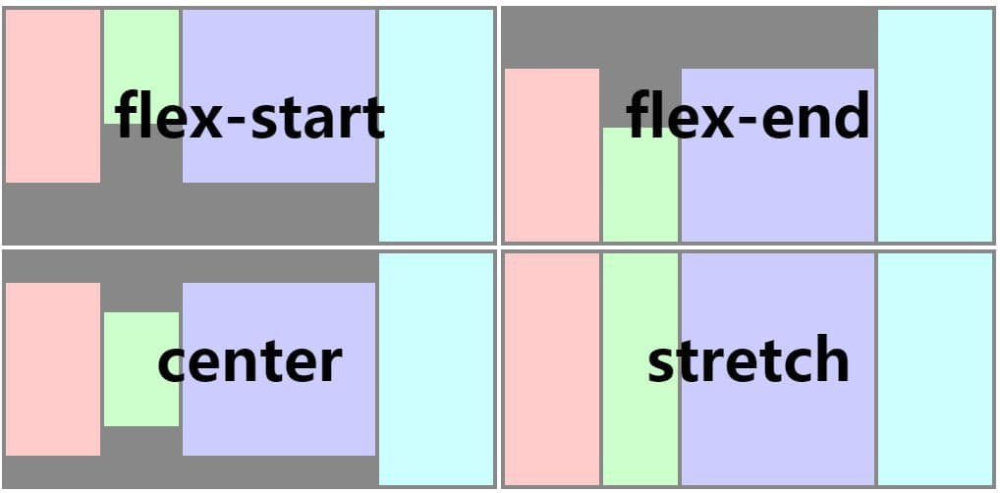

# Flexbox

## 简介

布局模型基于 CSS `Flexbox`，以便所有页面元素的排版能够一致可预测，同时页面布局能适应各种设备或者屏幕尺寸。Flexbox 包含 flex 容器和 flex 成员项。如果一个 元素可以容纳其他元素，那么它就成为 flex 容器。

文档中未说明的 flexbox 属性均不支持：如 `order`、`flex-flow` 等。

## Flex 容器

Flexbox 是默认且唯一的布局模型，所以你不需要手动为元素添加 `display: flex;` 属性。

### direction

`direction`决定了文字方向和**Flex容器**的基线方向。默认值为`ltr`。

- `ltr`: 文字和其他元素从左到右排布
- `rtl`: 文字和其他元素从右到左排布。

TIP

尽管 `direction` 不是 Flexbox模型的一部分，但却对 Flexbox 模型有着影响。

### flex-direction

```
flex-direction`定义了 flex 容器中 flex 成员项的排列方向，默认值为 `column
```

- `column`：从上到下排列。
 - `column-reverse`: 从下到上排布
 - `row`：如果存在`direction:ltr`，则从左到右排布；如果存在`direction:rtl`，则从右到左排布。
- `row-reverse`: 排布方向与`flex-direction:row`相反

### flex-wrap

```
flex-wrap`属性决定了`Flex成员项`在一行还是多行分布，默认值为`nowrap
```

- `nowrap`: `Flex成员项`在一行排布，排布的开始位置由`direction`指定。
- `wrap`：`Flex成员项`在多行排布，排布的开始位置由`direction`指定
- `wrap-reverse`: 行为类似于`wrap`，排布方向与其相反。

### justify-content

定义了 flex 容器中 flex 成员项在主轴方向上如何排列以处理空白部分。可选值为 `flex-start` | `flex-end` | `center` | `space-between`，默认值为 `flex-start`。

- `flex-start`：是默认值，所有的 flex 成员项都排列在容器的前部；
- `flex-end`：则意味着成员项排列在容器的后部；
- `center`：即中间对齐，成员项排列在容器中间、两边留白；
- `space-between`：表示两端对齐，空白均匀地填充到 flex 成员项之间。


### align-items

定义了 flex 容器中 flex 成员项在纵轴方向上如何排列以处理空白部分。可选值为 `stretch` | `flex-start` | `center` | `flex-end`，默认值为 `stretch`。

- `stretch` 是默认值，即拉伸高度至 flex 容器的大小；
- `flex-start` 则是上对齐，所有的成员项排列在容器顶部；
- `flex-end` 是下对齐，所有的成员项排列在容器底部；
- `center` 是中间对齐，所有成员项都垂直地居中显示。



## Flex 成员项

### flex

flex 属性定义了 flex 成员项可以占用容器中剩余空间的大小。如果所有的成员项设置相同的值 `flex: 1`，它们将平均分配剩余空间。如果一个成员项设置的值为 `flex: 2`，其它的成员项设置的值为 `flex: 1`，那么这个成员项所占用的剩余空间是其它成员项的 2 倍。Flex 成员项暂不支持 `flex-shrink` 和 `flex-basis` 属性。

- `flex {number}`：值为 number 类型。**该属性不支持** `flex: <flex-grow> | <flex-shrink> | <'flex-basis>` 的简写。

## 定位

支持 `position` 定位，用法与 CSS position 类似。为元素设置 `position` 后，可通过 `top`、`right`、`bottom`、`left` 四个属性设置元素坐标。

- `position {string}`：设置定位类型。可选值为`relative`|`absolute`|`fixed`|`sticky`，默认值为`relative`。
	- `relative` 是默认值，指的是相对定位；
    - `absolute` 是绝对定位，以元素的容器作为参考系；
    - `fixed` 保证元素在页面窗口中的对应位置显示；
    - `sticky` 指的是仅当元素滚动到页面之外时，元素会固定在页面窗口的顶部。
- `top {number}`：距离上方的偏移量，默认为 0。
- `bottom {number}`：距离下方的偏移量，默认为 0。
- `left {number}`：距离左方的偏移量，默认为 0。
- `right {number}`：距离右方的偏移量，默认为 0。