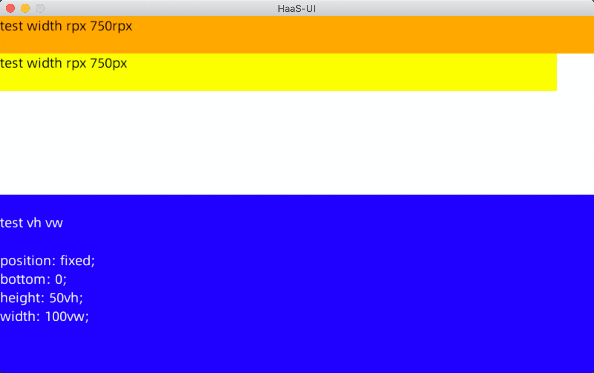

# 多分辨率自适应机制

## 使用场景

在实际产品中，屏幕尺寸会有变化，因此需要在编码阶段考虑到自适应不同屏幕尺寸

注：此处屏幕尺寸的宽高比例不能有较大差异，否则从UED角度需要重新出设计稿


## 方法1：【推荐】px 布局 + viewport指定

原理：按照 viewport 与 device width 进行比例转换

使用方法：

1. 在 app.js 中设定 viewport

```javascript
/**
   * 应用生命周期:应用启动. 初始化完成时回调,全局只触发一次.
   * @param {Object} options 启动参数
   */
  onLaunch(options) {
    super.onLaunch(options)
    this.setViewPort(800)
  }
```

1. 在 app 中布局均使用 px，宽度按照 800px 来布局

如何理解：

可以假设我们在一张指定 viewport 为 800px 的窗口中布局，最终系统框架会将这个虚拟布局尺寸缩放到最终的设备宽高尺寸上。

## 方法2：rpx 布局

原理：按照 viewport 固定为 750rpx 与 device width 进行比例转换，即 750rpx 等于 100% device width

使用方法：

与网页、其他小程序框架一样使用方式

```javascript
.test {
	width: 750rpx;
}
```

这种方式如果设计稿为 750px 宽度那么极为方便，否则就需要对设计稿的px 值做等比转换

## 方法3：vw/vh 机制布局

原理：按照 device width 做百分比计算后的像素

使用方法：

与网页 vw vh 使用方式一样

vw：相对于 device width 的宽度百分比，视窗宽度为 100vw

vh：相对于 device width 的高度百分比，视窗高度为 100vh

```javascript
.test {
  position: fixed;
  top: 0;
	height: 50vh;
  width: 100wh;
}
```

## 效果



