# CSS切换-多主题切换

# 通用-主题】如何配置一套主题色

## 背景

UED 出设计稿时通常会有设计规范，通过提炼我们可以归纳为：色彩、字体、字号、边距、间距、圆角、线条。

通过调整并利用好这几组变量即可使产品风格产生很多变化。

可修改变量可参考附录《主题系统样式表》章节


如下例我们使用 ui-demo 作为基础进行演示。

> 虽然通篇文章在讲主题切换（样式），但是也可以用来控制屏幕尺寸等css variable，例如：通过编译期设定 app.json 的选项 options.style.themes，控制哪个屏幕尺寸 css 被编译到小程序中。

## 效果

可以看到主题色、间距等已经发生变化

          

​                    

## 实现

### falcon-ui 主题机制简介

由于 falcon-ui 主题机制在 app.json 中提供了指定 theme-custom 名称，并约定路径进行加载

约定的路径格式为：`src/styles/<theme-custom>/`

其中的组织形式与 falcon-ui 中内置的主题样式组织形式一致，以 theme-dark 为例有如下主要文件：


- component 中是对组件的样式定制
- globals/theme.variables.less 是全局变量覆盖
	- 全局变量在 falcon-ui/src/styles/globals/theme.variables.less
- theme.config.js 是对组件的默认 props 做覆盖，比如 radio size 等


### 主题色定制举例

主要目标是覆盖 theme.variables.less 定义

我们定义两套 theme 分别为 custom-theme1 、custom-theme2

- 主题目录结构创建

利用 falcon-ui 主题加载机制，我们创建如下目录结构，并在 app.json 中使用 customTheme 变量进行切换。

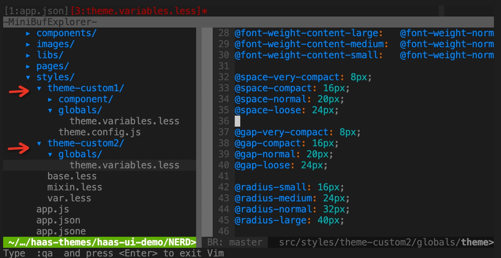

- app.json 主题切换

```json
{
  // ...
  "options": {
    "style": {
      "themeCustom": "theme-custom2"
    }
  }
}
// 或者 
{
  // ...
  "options": {
    "style": {
      "themeCustom": "theme-custom1"
    }
  }
}
```

- 主题样式内容

styles/theme-custom1/globals/theme.variables.less

```css
@primary: #3960CC;
@white: #FFFFFF;
@black: #000000;
@background-color: #0C121B;
@card-background-color: #232930;
@secondary: #353D48;
@btn-background-color: #4B5462;
@light-green: #7CFF00;
@green: #2D901E;
@blue: #376FDB;
@yellow: #FF9500;
@purple: #893FCD;
@cyan: #209AAD;
@red: #EF4141;

@font-size-title-large: 36px;
@font-size-title-medium: 32px;
@font-size-title-small: 28px;

@font-weight-title-large:   @font-weight-medium;
@font-weight-title-medium:  @font-weight-medium;
@font-weight-title-small:   @font-weight-medium;

@font-size-content-large: 24px;
@font-size-content-medium: 20px;
@font-size-content-small: 18px;

@font-weight-content-large:   @font-weight-normal;
@font-weight-content-medium:  @font-weight-normal;
@font-weight-content-small:   @font-weight-normal;

@space-very-compact: 4px;
@space-compact: 8px;
@space-normal: 12px;
@space-loose: 16px;

@gap-very-compact: 4px;
@gap-compact: 8px;
@gap-normal: 12px;
@gap-loose: 16px;

@radius-small: 2px;
@radius-medium: 4px;
@radius-normal: 6px;
@radius-large: 8px;

@border-small: 1px;
@border-medium: 2px;
@border-normal: 3px;
@border-large: 4px;
```

styles/theme-custom2/global/theme.variables.less

```css
@primary: #0ECC9B;
@white: #FFFFFF;
@black: #000000;
@background-color: #1D2336;
@card-background-color: #3A455F;
@secondary: #4D5571;
@btn-background-color: #737F9C;
@light-green: #7CFF00;
@green: #2D901E;
@blue: #376FDB;
@yellow: #FF9500;
@purple: #893FCD;
@cyan: #209AAD;
@red: #EF4141;

@font-size-title-large: 36px;
@font-size-title-medium: 32px;
@font-size-title-small: 28px;

@font-weight-title-large:   @font-weight-medium;
@font-weight-title-medium:  @font-weight-medium;
@font-weight-title-small:   @font-weight-medium;

@font-size-content-large: 24px;
@font-size-content-medium: 20px;
@font-size-content-small: 18px;

@font-weight-content-large:   @font-weight-normal;
@font-weight-content-medium:  @font-weight-normal;
@font-weight-content-small:   @font-weight-normal;

@space-very-compact: 8px;
@space-compact: 16px;
@space-normal: 20px;
@space-loose: 24px;

@gap-very-compact: 8px;
@gap-compact: 16px;
@gap-normal: 20px;
@gap-loose: 24px;

@radius-small: 16px;
@radius-medium: 24px;
@radius-normal: 32px;
@radius-large: 40px;

@border-small: 1px;
@border-medium: 2px;
@border-normal: 3px;
@border-large: 4px;
```

## 效果

可以看到主题色、间距等已经发生变化

原主题

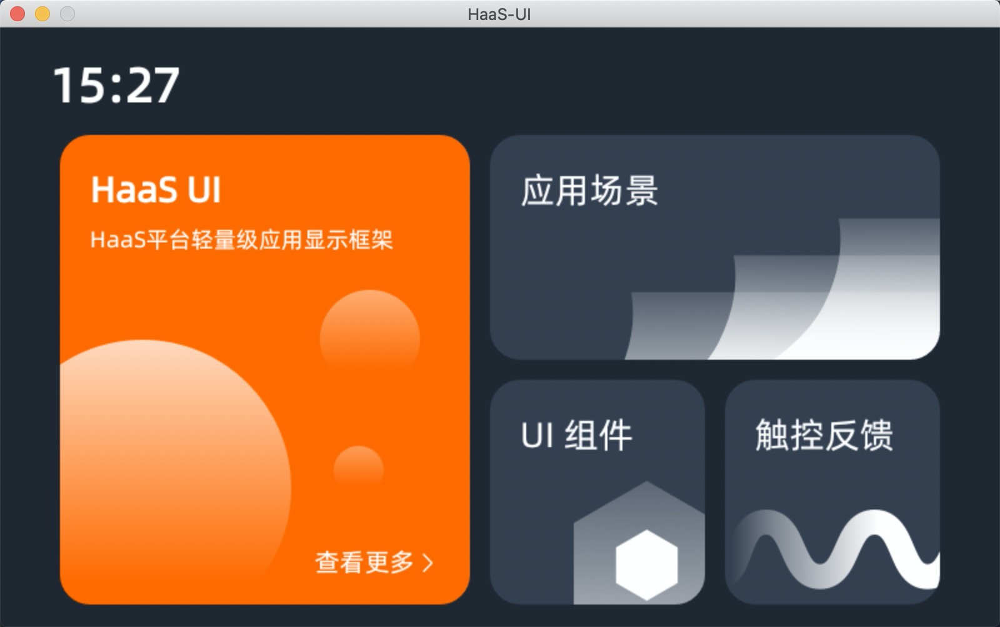

主题1

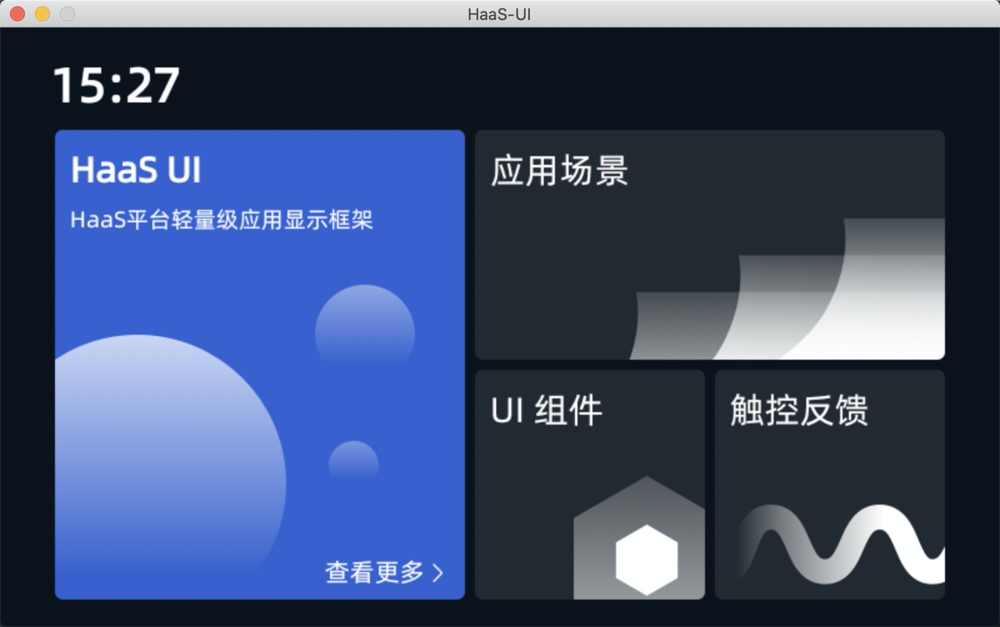

主题2

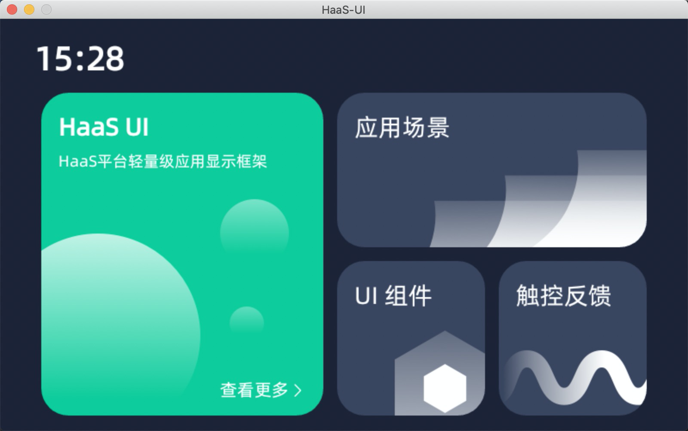

## 主题变量设计&应用原理

如下列出主题变量中应用的场景，可以灵活使用。

- 色彩
	- 主题色，比如 primary button 即主题色；
	- 背景色，比如页面背景色；
    - 卡片背景色，顾名思义，卡片元素的背景色，视觉上会与背景色区分；
    - 辅助色，一些组件设计时主色相对的辅助色， 比如按钮有“确定”“取消”，其“确定”一般为主色，另外为辅助色；
    - 按钮色，按钮默认（default）时的颜色；
    - 功能色_*，其他色相，配合使用颜色成体系。

- 字体、字号、字重
	- 标题：大中小标题
    - 正文：正文、二级正文、辅助文

- 边距
	- 通常为 padding，即内容到容器边的距离
	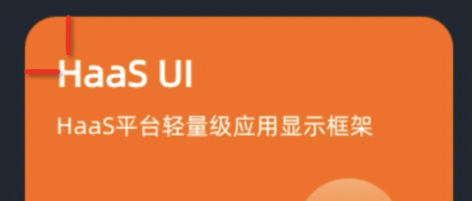

- 间距
	- 通常为 margin，即两个元素之间的距离
	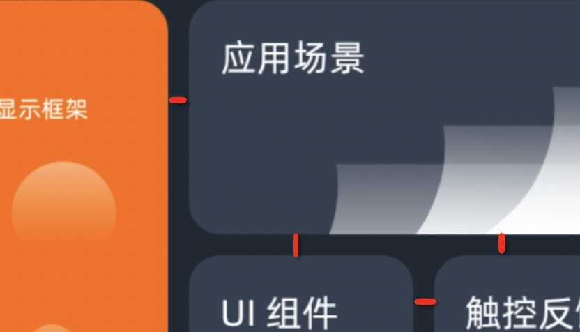

- 圆角
	- 通常为 border-radius，即容器的边角圆弧
	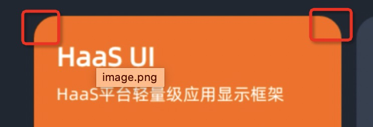

- 线条
	- 通常为 border-width，即容器边的粗细
	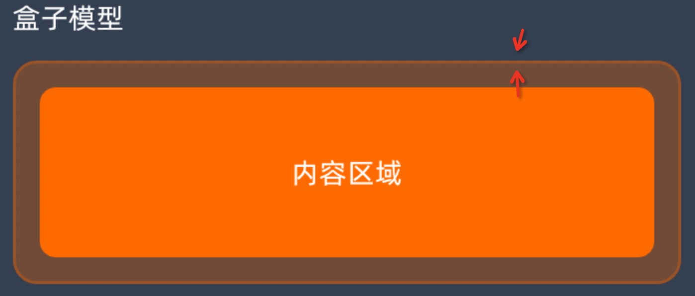

# 【通用-主题】theme切换系统机制

## 编译配置

在 app.json 中配置theme后，通过 cli 编译主题样式

```javascript
+++ b/src/app.json
@@ -26,7 +26,7 @@
   },
   "options": {
     "style": {
+        "themes": ["theme-dark", "theme-custom1", "theme-custom2"]
     }
   }
 }
```

## 系统全局配置

```javascript
+++ b/resources/env.json
+{"theme":"theme-custom2"}
```

## 系统动态改变

```javascript
+  methods: {
+    onChangeTheme() {
+      const themes = ["theme-dark", "theme-custom1", "theme-custom2"]
+      this.index = this.index || 0
+      this.index = this.index++ % themes.length
+      const theme = themes[this.index]
+      $falcon.env.custom.$set('theme', theme)
+    }
```

# 【通用-主题】如何修改主题色

## 需求

radio button 默认的橘色不适合，需要改为蓝色。

实现方法：通过修改less变量的主题色 @primary 来实现。

## 实现

1. 在 src/styles/theme-custom/globals/theme.variables.less 中声明 less 变量


## 效果

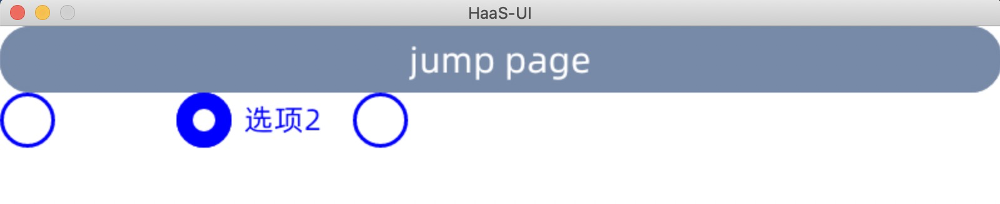

## 原理

在 globals/theme.variables.less 中定义的这些变量会在 falcon-ui 编译过程中注入，并覆盖原有声明变量。

所有可修改变量可以在 node_modules/falcon-ui/src/styles/globals/theme.variables.less 中查看

建议可修改变量可参考附录《主题系统样式表》章节

# 【通用-主题】如何修改控件样式

## 背景

想要对某一个控件样式做全局调整，比如想要 radio button 的 label 成竖向排列。

## 实现

- 创建文件 src/styles/component/radio.overrides.less，并添加样式

```javascript
.radio-item {
  flex-direction: column;
}
```

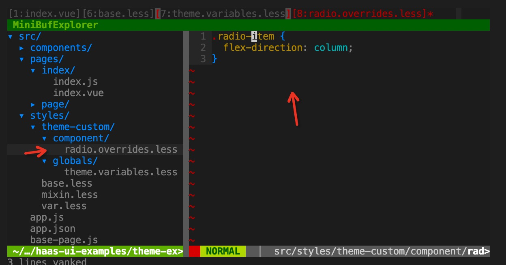

## 效果

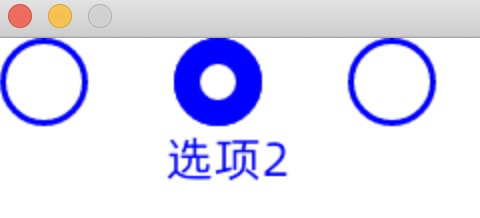

## 原理

falcon-ui 主题框架中，对每个组件设计留有覆盖机制，因此 componet/xxx.overrides.less 会被作为 css style 覆盖到控件 `<style></style>` 内部最下方，因此会将上方声明的相关样式做覆盖操作。


# 【通用-主题】如何利用内置主题变量

## 背景

falcon-ui 控件库主题十分统一，而封装custom 控件时如果理解并统一使用主题变量，后续风格调整会一起变化。

关于主题变量，建议使用几组全局控制开关，包括色彩、字体、字号、边距、间距、圆角、线条。

可参考附录《主题系统样式表》章节

## 实现

- 在 src/styles/base.less 中添加 falcon-ui 主题色变量引用

```javascript
@import "falcon-ui/src/styles/theme.less";
```

- 在 index.vue 需要使用的页面引用 base.less

```css
<style lang="less" scoped>
@import "base.less";
// ...
</style>
```

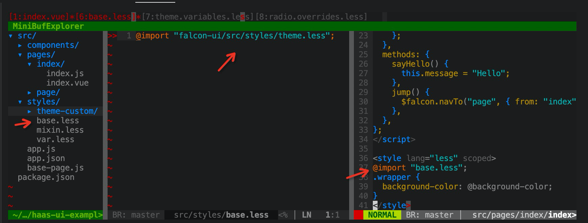


- 在 css style 中使用样式变量，比如 @background-color

```vue
<template>
  <div class="wrapper">
    <fl-radio :items="radioItems" v-model="radioValue" />
  </div>
</template>
<style lang="less" scoped>
.wrapper {
  background-color: @background-color;
}
</style>
```

## 效果

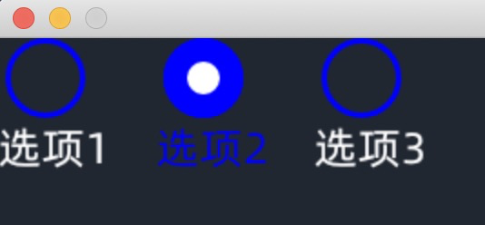

# 附录：主题系统样式表

### 样式架构

- 色彩
- 字体
- 字号
- 边距
- 间距
- 圆角
- 线条

### 色彩

<table>
 <tr>
    <td >主题色</td>
    <td style="background-color: #FF6A00;"></td>
    <td >#FF6A00</td>
    <td >@primary</td>
  </tr>
   <tr>
    <td >白色</td>
    <td style="background-color: #FFFFFF;"></td>
    <td >#FFFFFF</td>
    <td >@white</td>
  </tr>
   <tr>
    <td >黑色</td>
    <td style="background-color: #000000;"></td>
    <td >#000000</td>
    <td >@black</td>
  </tr>
    <tr>
    <td >背景色</td>
    <td style="background-color: #202731;"></td>
    <td >#202731</td>
    <td >@background-color</td>
  </tr>
  <tr>
    <td >卡片背景色</td>
    <td style="background-color: #343F50;"></td>
    <td >#343F50</td>
    <td >@card-background-color</td>
  </tr>
   <tr>
    <td >辅助色</td>
    <td style="background-color: #48586F;"></td>
    <td >#48586F</td>
    <td >@secondary</td>
  </tr>
  <tr>
    <td >按钮色</td>
    <td style="background-color: #778AA7;"></td>
    <td >#778AA7</td>
    <td >@btn-background-color</td>
  </tr>
   <tr>
    <td >功能色_荧光</td>
    <td style="background-color: #7CFF00;"></td>
    <td >#7CFF00</td>
    <td >@light-green</td>
  </tr>
   <tr>
    <td >功能色_绿</td>
    <td style="background-color: #2D901E;"></td>
    <td >#2D901E</td>
    <td >@green</td>
  </tr>
    <tr>
    <td >功能色_蓝</td>
    <td style="background-color: #376FDB;"></td>
    <td >#376FDB</td>
    <td >@blue</td>
  </tr>
   <tr>
    <td >功能色_黄</td>
    <td style="background-color: #FF9500;"></td>
    <td >#FF9500</td>
    <td >@yellow</td>
  </tr>
   <tr>
    <td >功能色_紫</td>
    <td style="background-color: #893FCD;"></td>
    <td >#893FCD</td>
    <td >@purple</td>
  </tr>
   <tr>
    <td >功能色_青</td>
    <td style="background-color: #209AAD;"></td>
    <td >#209AAD</td>
    <td >@cyan</td>
  </tr>
   <tr>
    <td >功能色_红</td>
    <td style="background-color: #EF4141;"></td>
    <td >#EF4141</td>
    <td >@red</td>
  </tr>
</table>

状态色彩：

通过不透明度区分组件的状态（此配置不建议在可配置样式表中）

正常 - 100%

点击 - 60%

禁用 - 40%


### 字体

| 默认（中，英文，数字，符号） | 阿里巴巴普惠体   |
| ---------------------------- | ---------------- |
| 特殊数字                     | Alibaba Sans 102 |

### 字号/字重（基于4寸屏）

| 标题     | 大标题 | 36      | Medium                                                       | @font-size-title-large@font-weight-title-large     |
| -------- | ------ | ------- | ------------------------------------------------------------ | -------------------------------------------------- |
| 中标题   | 32     | Medium  | @font-size-title-medium [normal?]@font-weight-title-medium [normal?] |                                                    |
| 小标题   | 28     | Medium  | @font-size-title-small@font-weight-title-small               |                                                    |
| 正文     | 正文   | 24      | Regular                                                      | @font-size-content-large@font-weight-content-large |
| 二级正文 | 20     | Regular | @font-size-content-medium [normal?]@font-weight-content-medium |                                                    |
| 辅助文   | 18     | Regular | @font-size-content-small@font-weight-content-small           |                                                    |

### 边距（基于4寸屏）

| 极紧 | 8px  | @space-very-compact |
| ---- | ---- | ------------------- |
| 紧凑 | 16px | @space-compact      |
| 标准 | 24px | @space-normal       |
| 宽松 | 32px | @space-loose        |

### 间距（基于4寸屏）

| 极紧 | 8px  | @gap-very-compact |
| ---- | ---- | ----------------- |
| 紧凑 | 16px | @gap-compact      |
| 标准 | 24px | @gap-normal       |
| 宽松 | 32px | @gap-loose        |

### 圆角（基于4寸屏）

| 小   | 8PX  | @radius-small  |
| ---- | ---- | -------------- |
| 中   | 16PX | @radius-medium |
| 标准 | 24PX | @radius-normal |
| 大   | 32PX | @radius-large  |

### 边框

| 小   | 1PX  | @border-small  |
| ---- | ---- | -------------- |
| 中   | 2PX  | @border-medium |
| 标准 | 3PX  | @border-normal |
| 大   | 4PX  | @border-large  |
