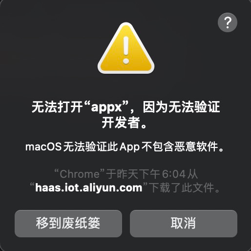
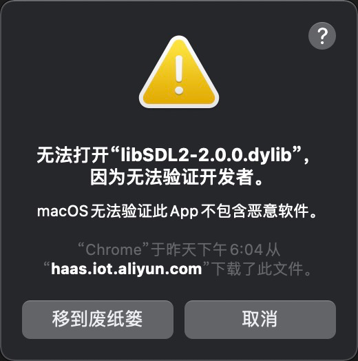
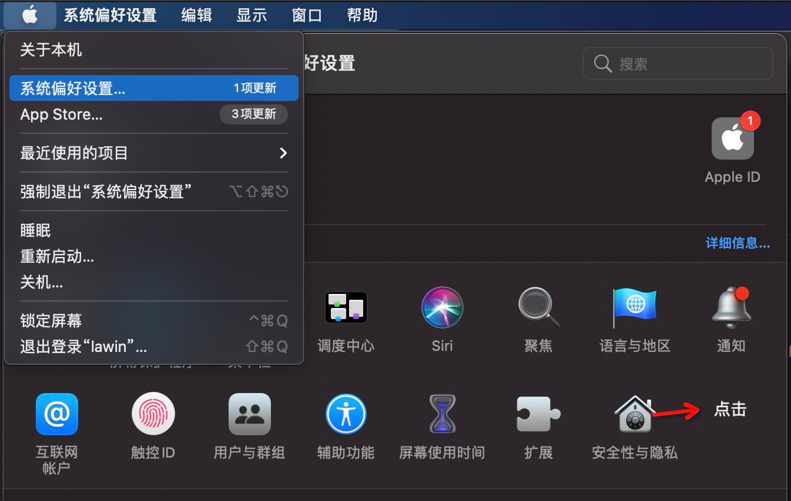
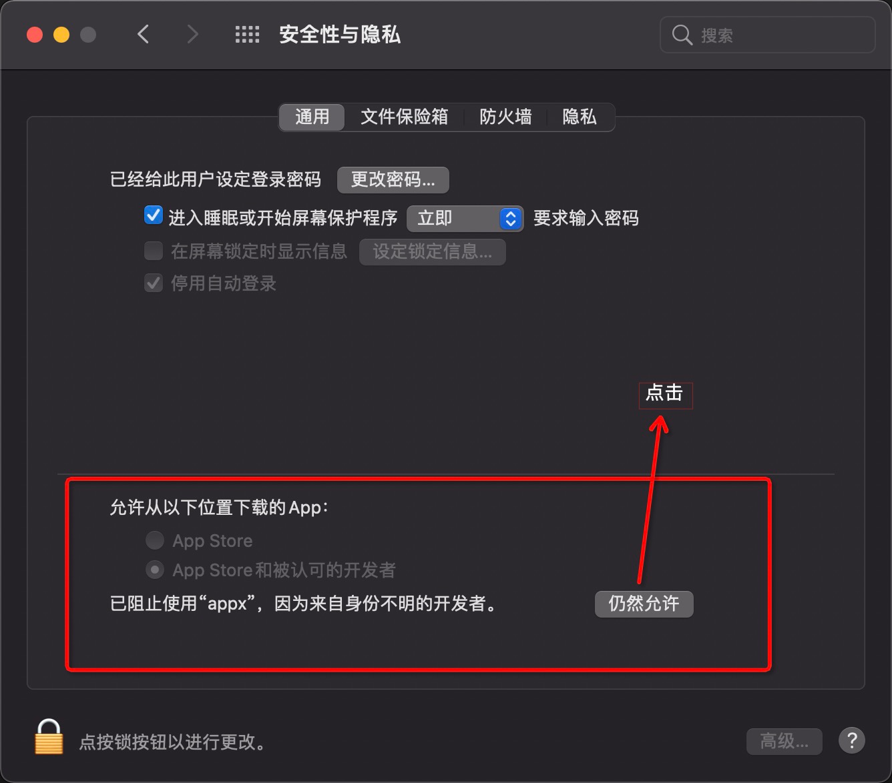
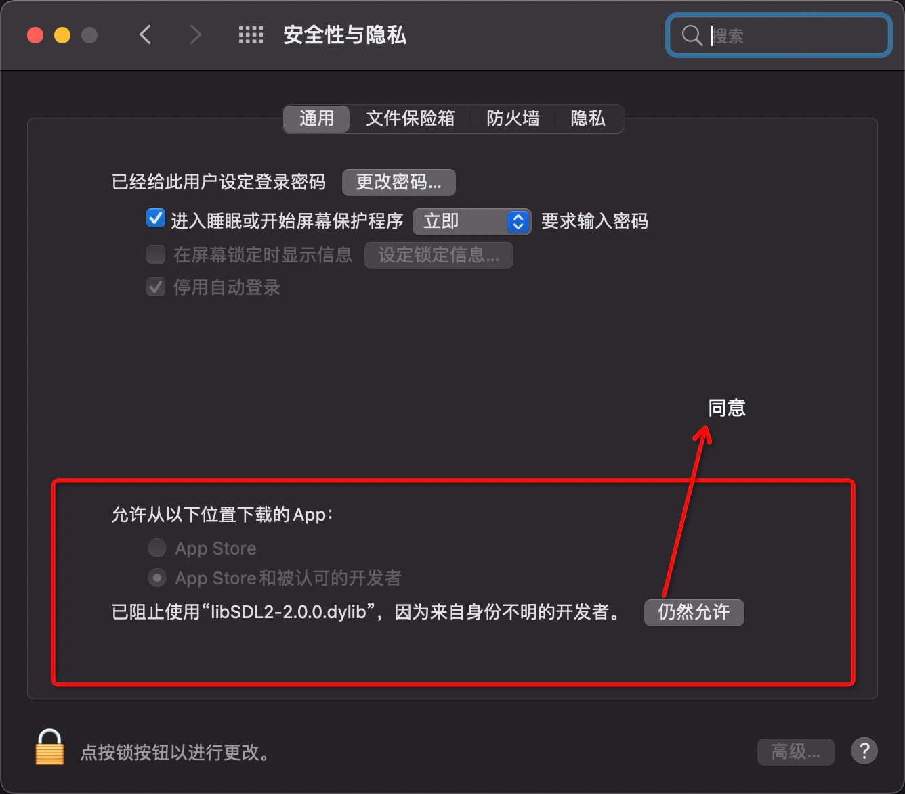

# 模拟器主要事项

# 模拟器运行注意事项(必看)

### MacOS系统电脑

同意之后，还需要点击打开才行

- 模拟器目前仅作为预览工具，非MacOS系统正式应用，所以会安全方面的2个提示，分为为 appx 以及 libSDL2-2.0.0.dylib，需要进行设置，提示如下图

- 进入安全性以及隐私页面

- 设置appx 可运行，操作如下

-  设置libSDL2-2.0.0.dylib 可运行，操作如下

- 设置完之后，再输入 cnpm run build:simulator 即可运行模拟器
