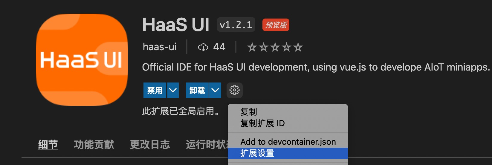
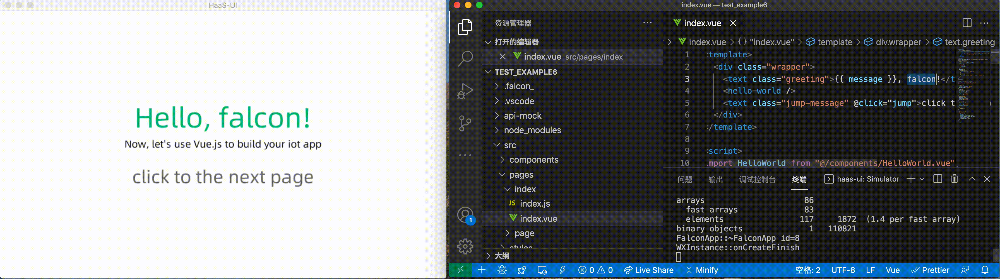

# 模拟器介绍

# 模拟器功能简介

使用模拟器可以实时预览页面(支持边修改代码边预览)，方便开发者开发、调试页面。

# 模拟器配置与运行

## 1、 配置模拟器路径

- 需要先安装开发插件
- 模拟器下载参见[链接](quick/env)

- Simulator Path用于配置模拟器的路径，用户可将模拟器的路径（appx所在的路径）配置到插件的Simulator Path中
  
  

## 2、 运行模拟器

-  点击Simulator预览图标即可启动模拟器
  
- 如果在MacBook上出现因执行权限问题导致的启动模拟器失败，可参照[链接](app/simulator/attention)进行解决
-  模拟器启动后，即可边修改代码边在模拟器上实时预览效果
  
- 若要停止实时预览，在vscode的Simulator终端中，输入ctrl + c即可

