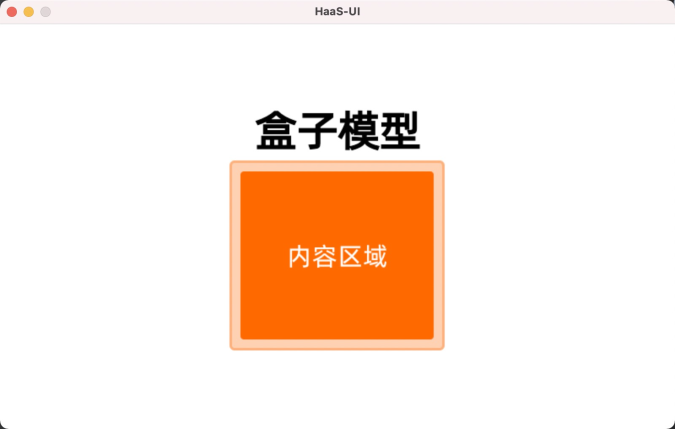

# \

## 显示效果

## 简介 

`
`> 是通用容器。

- 不要在 `
` 中直接添加文本，而要使用 `<text>` 组件。

- 目前默认`
` 不可滚动。

- 要控制 `
` 的层级，建议不要超过14层，否则会很影响页面性能。

## 子组件 

`
` 支持各种类型的子元素，包括 `
` 自己。

## 样式 

- 通用样式 支持所有通用样式。

## 事件 

- 通用事件 支持所有通用事件。
