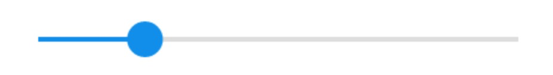

# \<seekbar>

## 显示效果



2.效果代码下载

## 简介

`<seekbar>` 组件用来创建带滑动进度条的组件。

**基本用法**

```html
<template>
  <seekbar class="seekbar" />
</template>

<script>
export default {
};
</script>

<style scoped>
.seekbar {
  width: 424px;
  height: 100px;
}
</style>
```

## 子组件

`<seekbar>` 不支持子组件。

## 属性

| key                  | 类型   | 描述                                     | 默认值      | 备注   |
| -------------------- | ------ | ---------------------------------------- | ----------- | ------ |
| `min`                | number | 最小值                                   | 0           | 需>=0  |
| `max`                | number | 最大值                                   | 100         | 需>min |
| `step`               | number | 步长，值必须大于0，并可被(max - min)整出 | 1           | >0     |
| `value`              | number | 当前值                                   | 0           |        |
| `active-color`       | Color  | 前景色(已拖动的进度条)                   | #108ee9     |        |
| `background-color`   | Color  | 进度条背景色                             | #dddddd     |        |
| `track-size`         | number | 进度条高度                               | 4           |        |
| `handle-size`        | number | 滑块大小                                 | 22          |        |
| `handle-color`       | Color  | 滑块颜色                                 | #108ee9     |        |
| `handle-inner-color` | Color  | 滑块内环颜色                             | transparent |        |

## 样式

#### 通用样式

支持所有通用样式

- 盒模型
- `flexbox` 布局
- `position`
- `opacity`
- `background-color`

查看 **组件通用样式**

## 事件

- **通用事件** 支持所有**通用事件**。
- **changing**. 拖动过程中触发的事件，会不断触发。
	 - @param value: 当前值。
- **change**. 完成一次拖动后触发。
	- @param value: 当前值。
