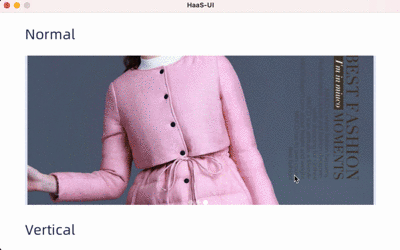

# \<slider>

## 显示效果




## 简介

Slider 组件用于在一个页面中展示多个图片，在前端这种效果被称为轮播图。默认的轮播间隔为3秒。

## 基本用法

```html
<template>
  <div>
    <slider class="slider" interval="3000" auto-play="true">
      <div class="frame" v-for="img in imageList">
        <image class="image" resize="cover" :src="img.src"></image>
      </div>
    </slider>
  </div>
</template>
<style scoped>
  .image {
    width: 700px;
    height: 700px;
  }
  .slider {
    margin-top: 25px;
    margin-left: 25px;
    width: 700px;
    height: 700px;
  }
  .frame {
    width: 700px;
    height: 700px;
    position: relative;
  }
</style>
<script>
  export default {
    data () {
      return {
        imageList: [
          { src: 'https://gd2.alicdn.com/bao/uploaded/i2/T14H1LFwBcXXXXXXXX_!!0-item_pic.jpg'},
          { src: 'https://gd1.alicdn.com/bao/uploaded/i1/TB1PXJCJFXXXXciXFXXXXXXXXXX_!!0-item_pic.jpg'},
          { src: 'https://gd3.alicdn.com/bao/uploaded/i3/TB1x6hYLXXXXXazXVXXXXXXXXXX_!!0-item_pic.jpg'}
        ]
      }
    }
  }
</script>
```

## 子组件

支持任意类型的 组件作为其子组件。

## 属性

| key                   | 类型    | 描述                                     | 默认值                | 备注                   |
| --------------------- | ------- | ---------------------------------------- | --------------------- | ---------------------- |
| `vertical`            | boolean | 是否纵向轮播                             | false                 | 常量，初始化后不可修改 |
| `auto-play`           | boolean | 是否自动开始轮播                         | false                 |                        |
| `interval`            | number  | 轮播间隔，单位ms                         | 3000ms                |                        |
| `index`               | number  | 设置显示slider的第几个页面               | 0                     |                        |
| `show-indicators`     | boolean | 是否显示页面指示器                       | false                 |                        |
| `infinite`            | boolean | 设置是否无限循环轮播（头尾相连）         | false                 |                        |
| `scrollable`          | boolean | 是否支持手势滑动                         | true                  |                        |
| duration              | number  | 滚动时间                                 | 500 毫秒              |                        |
| `item-color`          | Color   | 指示器默认颜色                           | rgba(255,255,255,0.5) |                        |
| `item-selected-color` | Color   | 指示器选中状态的颜色                     | white                 |                        |
| `item-size`           | number  | 指示器大小                               | 10                    |                        |
| `enable-acceleration` | boolean | 是否支持快速多页滑动                     | false                 |                        |
| `scale-factor`        | number  | 缩放因子，按照距离中心元素的距离进行缩放 | 1.f                   | （0,1]                 |
| `previous-margin`     | px      | 左边(上边)元素露出大小                   | 0px                   |                        |
| `next-margin`         | px      | 右边(下边)元素露出大小                   | 0px                   |                        |

## 样式

- **通用样式** 支持所有**通用样式**。

## 事件

- **通用事件** 支持所有**通用事件**。
- **change** 当轮播索引改变时，触发该事件。该事件给前端的参数中含有 `index`表示当前切换到的序号。

## 方法

- slideTo(int index, bool smooth)
	 - 手动控制轮播位置，index 为轮播位置，smooth控制切换时是否有动画效果
