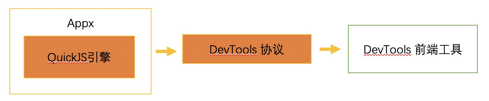

# 使用Chrome浏览器调试

基于Chrome提供的DevTools协议进行调试，

在chrome浏览器里输入：devtools://devtools/bundled/inspector.html?ws={ip地址}:9307

## 设备端开启方式

1. 确认编译选项打开

```vue
# DOM调试相关, JS内存分析相关, 小程序本地安装相关
set(ENABLE_DBG true)
add_definitions(-DENABLE_DBG)
```

1. 开启模拟器的 debug 功能（建议调试开发使用，避免造成安全问题）

	- 在 resources/cfg.json 中开启 debugger.enable true

```javascript
	"debugger": {
		"enable": true,
		"port_devtool": 9307,
		"port_httpd": 5556
	},
```

## DevTools 连接方式

1.设备与电脑在局域网里链接

#### 模拟器调试

ip地址为localhost

在chrome浏览器里输入：devtools://devtools/bundled/inspector.html?ws=localhost:9307

#### 真机调试

真机设备需要与当前电脑处于同一局域网，比如真机地址为 192.168.1.100

在chrome浏览器里输入：devtools://devtools/bundled/inspector.html?ws=192.168.1.100:9307

## 工具介绍

借助 devtools 协议和内存分析前端，实现了协议和内存分析后端（QuickJS引擎中）。

帮助开发者查看内存引用关系（即内存支配树），快速定位产品化过程中棘手的内存泄漏问题，可以大量节省时间，将原来几个周的定位时间缩短到1天内解决。

