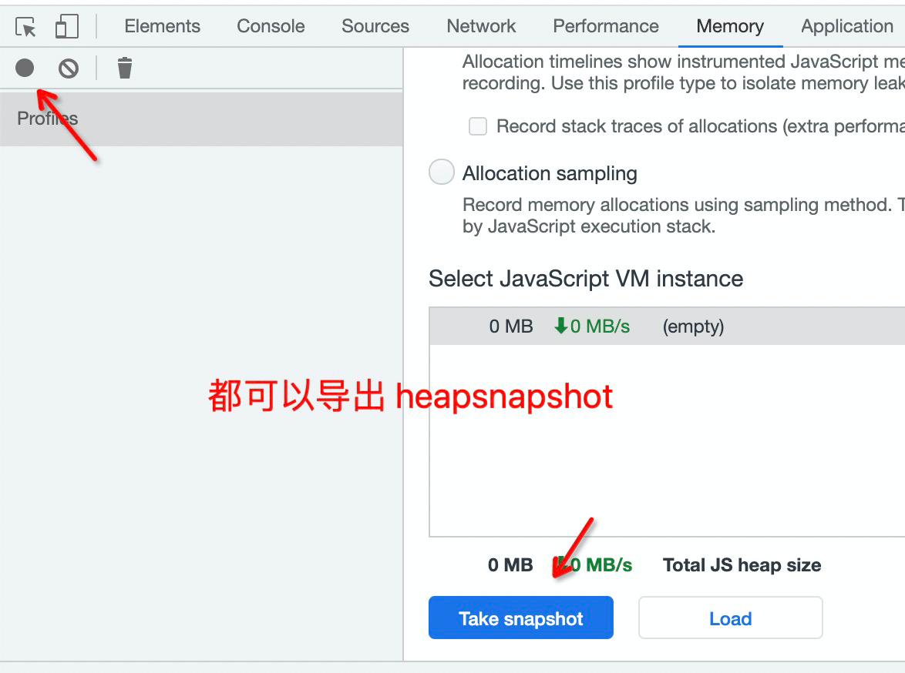
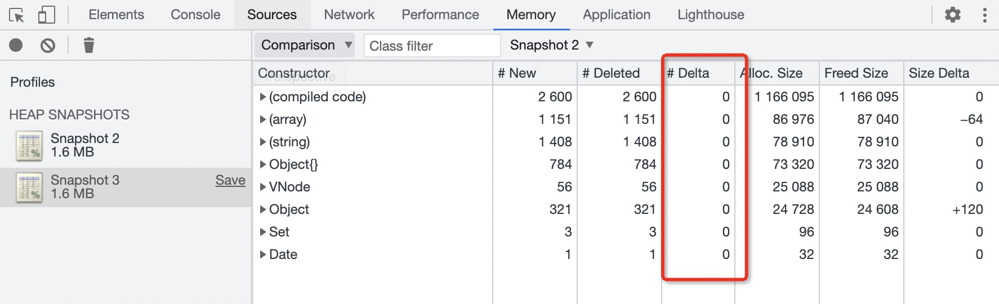
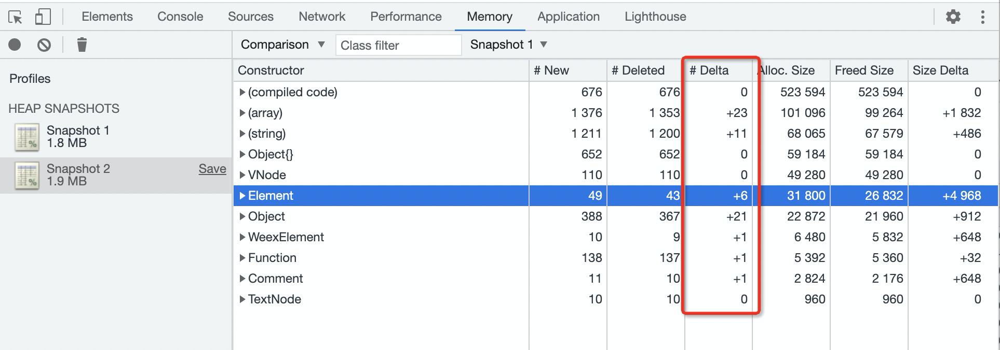
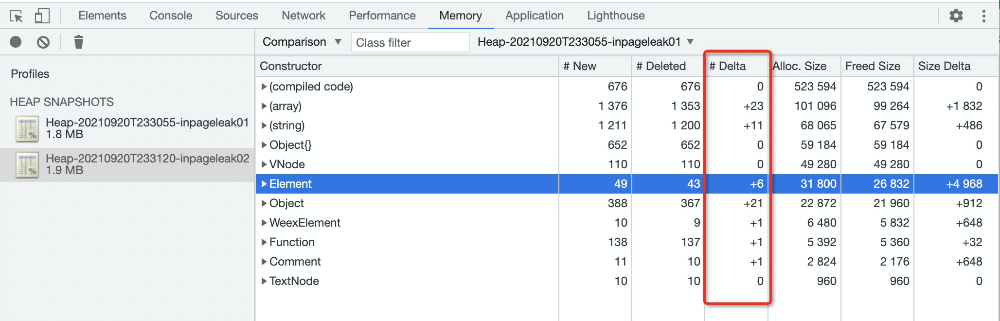
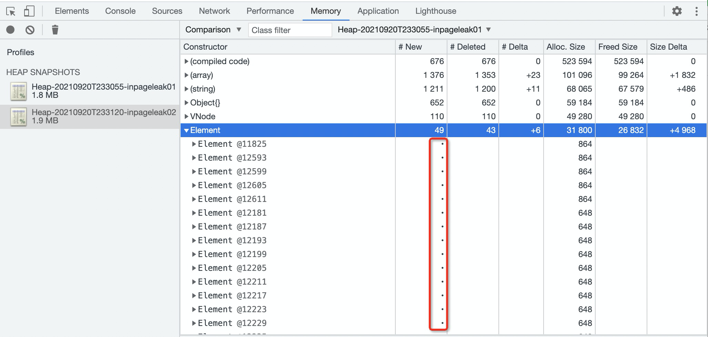
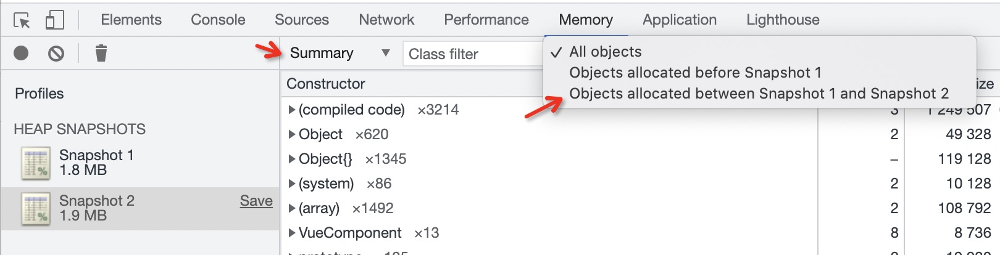
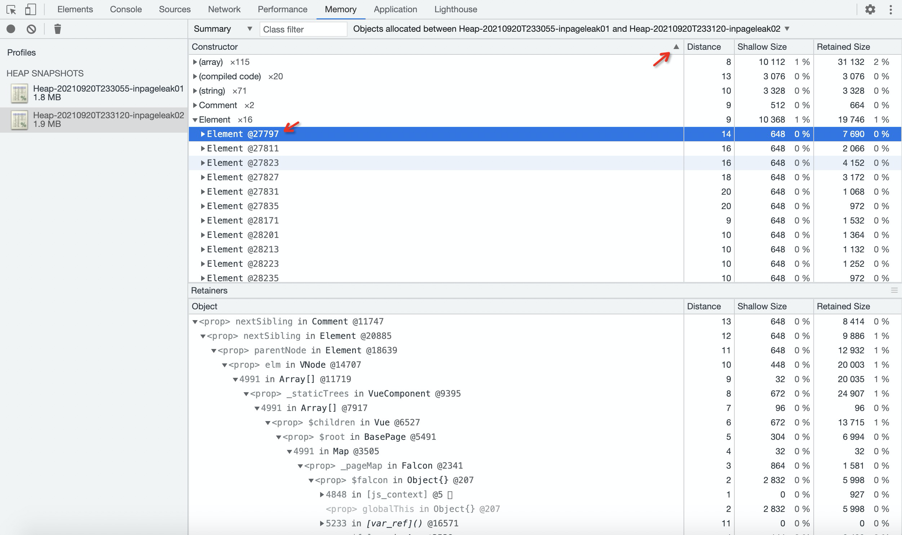
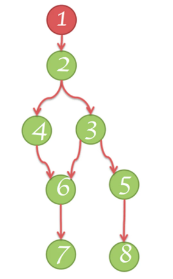
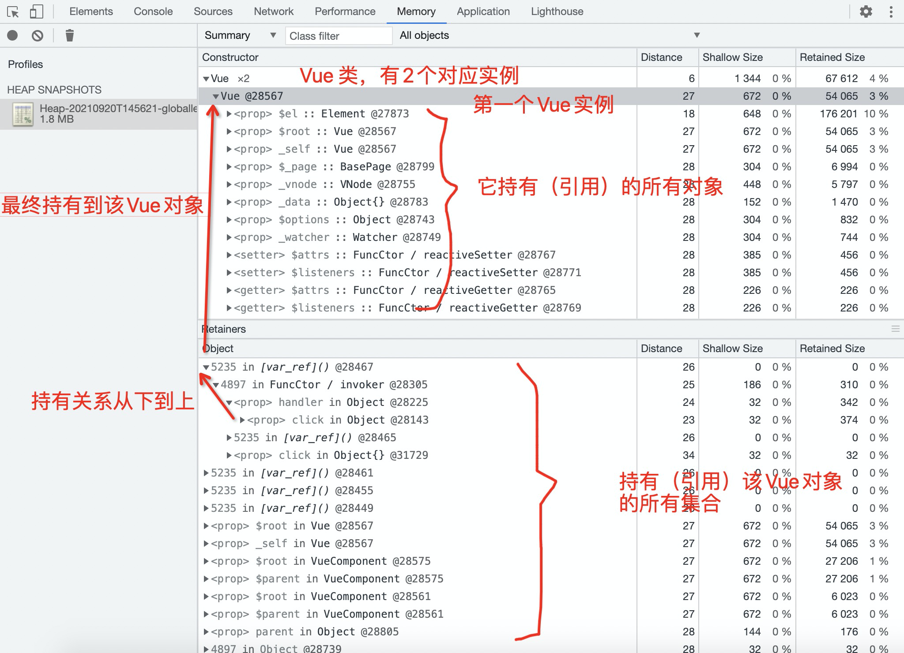
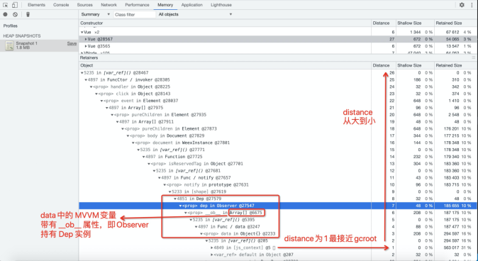

# 内存泄漏分析

# 快速开始

开启[DevTool调试功能](debug/chrome/chrome?id=devtools-连接方式)

## 


# 判定页面内存泄漏

## 背景

当前是否存在内存泄漏，如果明确有才有进一步分析的价值。

## 页面内存说明

当我们打开一个页面时，内存会有所增加，主要来自两个方面：

1. import page.js 时，页面作为一个 js模块被 js引擎加载，这个 js 模块作为代码段在内存中一直被持有。
2. 获取到 PageClass 后构造页面实例，即进行 new PageClass，并构造 Vue 组件（包含vnode 树，DOM 树等）。但是这个页面实例在页面退出时会被完整销毁。


因此**第一次进出页面**，内存略微上涨是因为 js 模块加载原因导致，**不算内存泄漏**。

**第二次进出页面，如果内存上涨则一定是内存泄漏**。


## 定位方法1（推荐）

通过 miniapp_cli 抓两次内存大小，前后比较

1. 第一次进出页面后
2. 第二次进出页面后

运行命令

```vue
miniapp_cli memoryUsage
```

通过分析 memory used COUNT一栏，前后对比数量是否有明显增加来判定内存泄漏。


## 定位方法2

通过 devtools 的两次 heapsnapshot 对比功能可确定是否有新增内存对象，用来判定页面内存是否有泄漏

如下我们抓两次内存heap 两两比较

1. 第一次进出页面后
2. 第二次进出页面后


仅关注 #Delta 一列，即数量增量，可以看到两次进出每个类别都是 0，因此没有内存泄漏。




## 一个泄漏的例子

我们既能定位页面进出的内存情况，也可以定位页面内的内存情况。

比如这个例子，在同一页面切换两个tab，对页面组件进行 v-if 创建和销毁，几次操作后发现内存有所上涨。



# **定位新增对象**

## 背景

判定有内存泄漏后，对比内存时发现增加了几个，但具体增加了哪几个？需要选定哪个对象进一步分析？


## 问题

借页面内泄漏问题说明



如上图，其中 Element 元素明显不应该泄漏，因为 VNode都已经释放干净，其中有6个增加，但是展开后发现好多新增，并不是增量 #Delta 列表，而是全部新增#New & 删除#Delete 列表。

比如第一个对象 ID 为 @11825，它在 #New 这列标注黑点，但下面同样ID @11825 对象在 #Delete 列也标注黑点。因此没有做两两抵消后的 Delta 列表。



此时需要使用 DevTools Summary 界面中的新增 Object 筛选功能

注意到这里的 Object 数量并不等于如上 Delta 数量 +6，是合理的，这 17 个对象确实是两次 heap 间增加并且没有被释放的。但依然需要小心选择，有些是因为操作新建的，其他才是应该释放而没被释放的内存泄漏点。

一般 ID 越小的对象，应该是内存泄漏点，因为两个页面切换，切过去创建一堆（ID较小），切回来创建一堆（ID较大）。

因此通过 Object 排序，我们选择 @27797 该对象分析。

注：内存对象的 ID 标记仅在 dump 过程发生，因此切到内存泄漏页面时临时 dump 一次但结果不用，这样强制将泄漏内存对象的 ID 先行绑定为小一些的 ID 号。







# 分析对象引用关系

## 背景

通过 heap快照对比，我们确定了泄漏对象，此时需要确定引发泄漏的关键点。

即分析 支配树（Dominator Tree），再次贴图：



## 问题

DevTools 可以完整展示支配树信息，需要掌握基础的工具使用方法才能进一步分析支配树。

## 分析

如下是一个页面泄漏例子，针对 Vue 分类中的**第一个 Vue 实例**来分析：

1. 上半部分，列出的是**它持有（引用）的所有对象。**

1. 1. 例如：Vue@28567 通过属性 $el 持有 Element@27873 对象

1. 点击该节点时，在下半部分列出**持有（引用）该Vue对象的所有集合**。

1. 1. 例如：$root 关系（下半部分向下数第7个对象），为 VueComponent@28575 对象通过 $root 属性持有Vue@27873

1. 展开下半部分某一节点，整条链持有关系**从下到上**，**最终持有到该Vue对象**。

1. 1. 例如：Object@28143通过 click 属性持有 Object@28225，又通过 handler 属性持有 FuncCtor / invoker@28305 构造函数，而该 invoker 函数通过闭包关系[var_ref] 持有我们分析的这个对象 Vue@28567

注：FuncCtor即构造函数ctor 在js中则是 class本身

至此我们可以清晰的看到围绕 Vue@27873 这个对象的支配树。



## 技巧

分析引用关系的关键在于找出被分析对象与GCRoot 之间路径中的关键引用节点，比如去掉关系3~5 则 5、6 节点就会被释放。

如上图  Distance 则为该节点到 GCRoot 的距离，整条链断开关键节点即可达到解决内存泄漏问题的目的。


比如下图是典型被分析对象 Vue@28567 到 Distance 1 的整条链路，通过切断 Array@6675 通过属性 __ob__ 向上的引用关键节点，就解决了内存泄漏问题。

并且下半部分 Retainers界面中默认 Distance 就是从递减排序，因此通常我们展开第一个引用节点时，就是到 GCRoot Distance 最小的整条链路。

