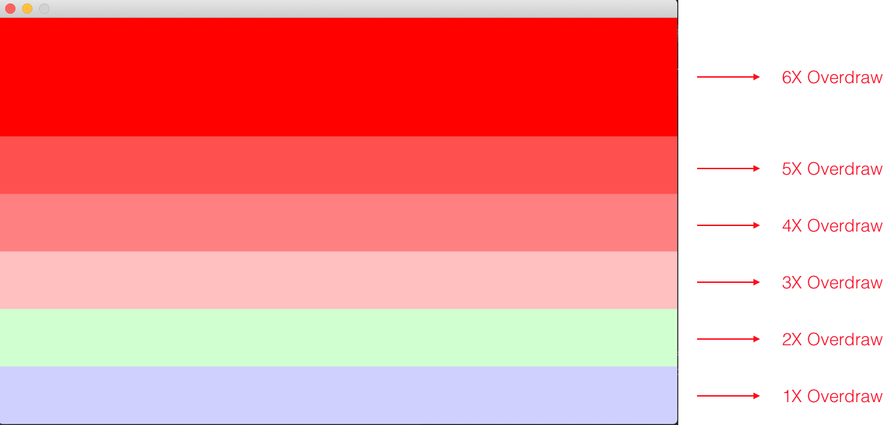
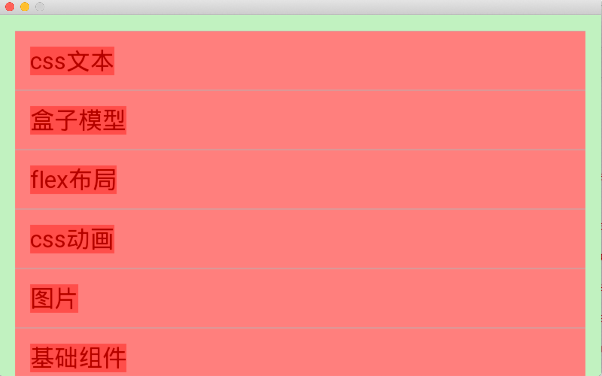

# 性能调试分析

### 过度绘制

过度绘制(Overdraw)描述的是屏幕上的某个像素在同一帧的时间内被绘制了多次

在多层次的UI结构里面， 如果不可见的UI也在做绘制的操作，这就会导致某些像素区域被绘制了多次，这就浪费大量的系统资源。

框架实现了一套检测过度绘制的功能（与安卓的效果类似），可以辅助分析性能问题。

#### 开关

/etc/miniapp/resources/cfg.json

```json
{
  "debugger": {
    "enable": true,
    "overdraw": true,
  }
}
```

#### 分析方法

打开开关之后查看界面混合颜色




示例：



