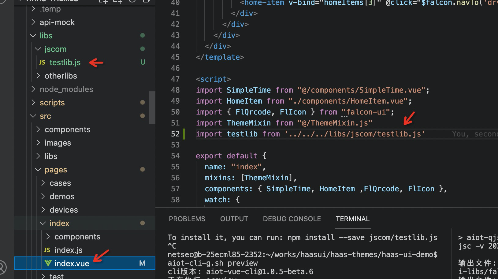
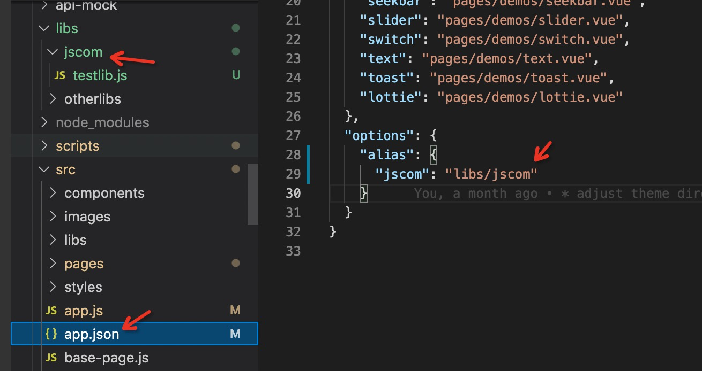
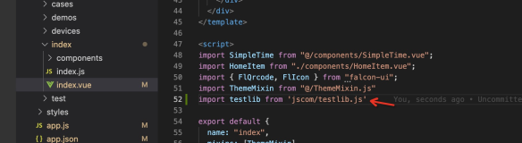

# 配置alias目录别名

  问题：

如果我们想要引入公共封装库，采用相对路径会比较繁琐，且不同目录层次页面中引入的方式也不同。

比如想要在 src/pages/index/index.vue 中引入 /libs/jscom/testlib.js 文件，使用相对目录需要，如图

```javascript
import testlib from '../../../libs/jscom/testlib.js'
```



## 使用

在 app.json 中配置 alias 目录别名，如下，其中 libs/jscom 相对于项目根目录配置

```javascript
  "options": {
    "alias": {
      "jscom": "libs/jscom"
    }
  }
```



在文件中引入，简单清晰，且在任何文件中引入方式一致

```javascript
import testlib from 'jscom/testlib.js'
```

