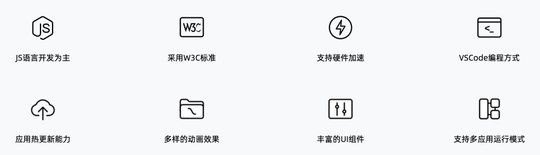
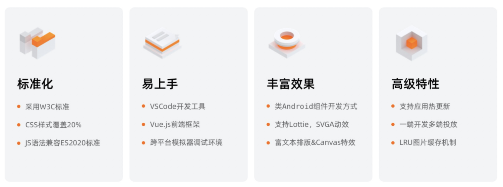
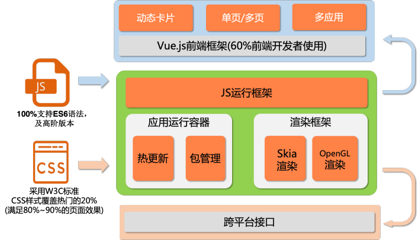

# 轻量级小程序框架介绍

  

## 定位 

是一套跨平台的轻量级应用引擎，包含UI显示框架、多应用&多服务能力、应用热更新能力

它利用 JS 语言低门槛和 API 标准化大幅度降低了 IoT 应用的研发难度  

目前支持 AliOS Things、Ubuntu、Linux、MacOS、Window 等系统上运行 

## 理念 

移动开发模式，全面拥抱 JavaScript 开源生态，且系统服务通过统一的 JSAPI，**实现一端开发，多端运行策略** 

 

## 框架特色 

 

## 组件效果 

 

## Chrome 浏览器体验 

UI 效果，可以通过浏览器体验，[请点击网站](https://hli.aliyuncs.com/xyfolder/miniapp-wasm/index.html) 

## 框架介绍 

多应用单页 / 多页动态卡片VUE.JS 前端框架 (60% 前端开发者使用)JS 运行框架渲染框架应用运行容器SKIAOPENGL热更新包管理渲染渲染CSS跨平台接口 

#### 前端框架能力 

- 前端框架：采用 Vue.js(v2.6.12) 开源框架, 实现了 W3C 标准的标签和样式子集 
- CSS 样式：详细见[链接](app/css/common/common) 
- 前端组件：详细见[链接](app/ui/base) 

#### 应用框架能力 

- 多应用能力：引入类似 android 应用理念，可以将 IoT 场景里将复杂的业务进行拆成多个应用，独立运行降低资源开销，当应用退出后则会回收内存资源 
- 热更新能力：支持应用的独立升级 (不依赖 OTA 升级)，实现应用更加敏捷的版本迭代 (包含 so 库) 
- 包管理能力：实现对不同应用的管理，基于该模块可以扩展出应用市场，可以实现三方应用的在线安装功能 

#### 图形框架能力 

- 图片解码：支持 jpeg、png 解码能力 

- 字体：支持 FreeType2 矢量字库 
- 支持 Lottie、SVGA 动画特效 
- 视频图层合并：支持 Video 层与 OSD 层叠加，目前建议自带视频硬件合成 (可有效降低 CPU 占用率) 
- GPU 硬件加速：支持通过 GreenUI 图形框架的 Canvas api，实现对不同渲染引擎的对接，通过扩展 OGLES 接口，实现对 GPU 硬件加速支持 

## 支持平台系统 

AliOS Things、Linux、Window、MacOS 系统 

## 推荐硬件 

- X2500
- X2600

