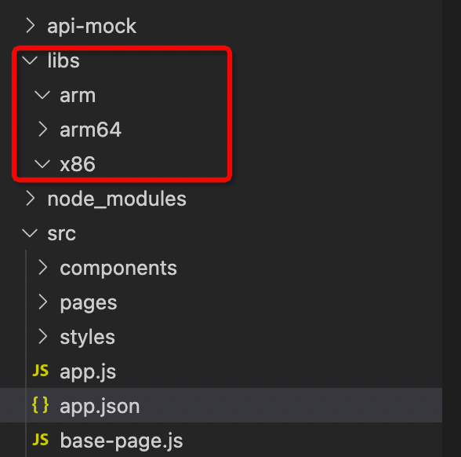

# 编译不同arch架构下私有库的amr包方案

  工程路径

在应用根目录创建libs文件夹(跟src目录同级)，且在该根目录下创建对应平台文件夹名字，如图：



### 已支持的arch

IoT小程序框架在编译时已带上对应arch架构，如

| arch架构名 | 说明        |
| ---------- | ----------- |
| arm        | 32位arm cpu |
| arm64      | 64位arm cpu |
| x86        | 32位x86 cpu |
| x86_64     | 64位x86 cpu |

### 细分SKU

如需支持更加arch架构，可以新增细分的sku，需要在编译miniapp时，配置参数指定目标sku的宏

```cmake
add_definitions(-DJQUICK_TARGET_SKU="coco")
# or
add_definitions(-DJQUICK_TARGET_SKU="almond")
```

此时，会优先解析带sku的lib目录，如libs/arm64-coco 或  libs/arm64-almond

如果该细分目录不存在，才使用libs/arm64 (目前只会选择一个一个文件夹路径)

### 打包构建产物

- 在执行打包构建的时候输出一个构建产物
- 应用安装到设备上时，PMS会根据芯片架构解压对应路径的so库到libs下面