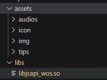

# Walos扩展JSAPI简介

  

在src同级目录中创建libs文件夹，将libjsapi_wos.so放置于其中即可调用

libs同级目录下新建名为 *assets* 的文件夹，资源文件可放此处，其它名称则无法被打包

libjsapi_wos.so需咨询获取

打包为Walos刷机包和升级包,需在linux环境下，详见[打包仓库](https://gitee.com/WalOS/haasui-package)