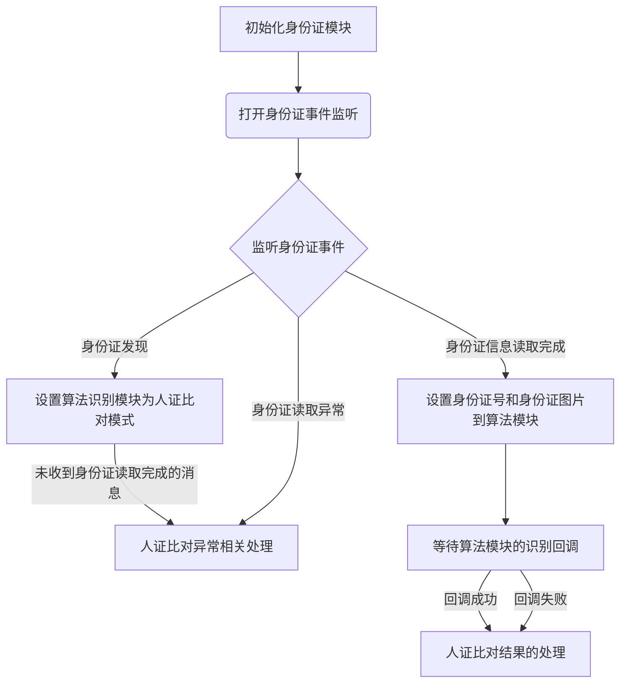

# **PID**

## 1.概述

封装了身份证等相关的使用

## 2.模块使用方式

```javascript
import { derk } from "pid"
this.derk = new derk()
```

## 3.derk模块,德科在线身份证模块

### 3.1 init

#### 参数

- port ： 串口号 2，3

#### 返回值

- promise 成功0 失败抛出异常

#### 用法示例

```javascript
this.derk.init({
  port: 2,
})
```

### 3.1 on("pid")监听刷身份证回调

#### 返回值

```json
{
    "event":0,//当前通知事件，见用法示例中的定义
    "name"："",//姓名
    "uuid":"",//身份证号
    "dma_addr":0,//身份证图片指针
    "dma_size":0
}
```

#### 用法示例

```javascript
IDCARD_NOTIFY_ERROR_DECODE = -5 // 人脸图片解码失败
IDCARD_NOTIFY_ERROR_SOCKET = -4 // SOCKET 通讯失败
IDCARD_NOTIFY_LEAVE = 0 // 证件离开
IDCARD_NOTIFY_FIND = 1 // 发现证件
IDCARD_NOTIFY_SUCCESS = 2 // 证件信息提取成功

this.derk.on("pid", (res) => {
    console.log("pid event")
    if (
        res.event === this.IDCARD_NOTIFY_FIND ||
        res.event === this.IDCARD_NOTIFY_LEAVE
    ) {
        if (isFunction(foundCb) || isAsyncFunction(foundCb)) {
            foundCb(res.event === this.IDCARD_NOTIFY_FIND)
        }
    } else if (res.event === this.IDCARD_NOTIFY_SUCCESS) {
        if (isFunction(readCb) || isAsyncFunction(readCb)) {
            readCb(res)
        }
    } else {
        let code = res.event
        let msg = ""
        if (code === this.IDCARD_NOTIFY_ERROR_SOCKET) {
            msg = "通讯失败，需检查网络"
        } else if (code === this.IDCARD_NOTIFY_ERROR_DECODE) {
            msg = "解码失败，需检查网络"
        }
        if (isFunction(errCb) || isAsyncFunction(errCb)) {
            errCb(code, msg)
        }
    }
})
```

#### 4.NOTES : 人证比对如何实现?

步骤：

1.初始化身份证模块 

2.打开身份证事件监听 

3.收到IDCARD_NOTIFY_FIND事件(身份证发现) 

4.设置算法模块setmode人证比对模式

5.收到 IDCARD_NOTIFY_SUCCESS（身份证信息解码完成）

6.算法模块pidadd设置身份证图片和身份证号码

7.等到人脸模块的人脸识别回调

8.显示结果

9.piddel清空数据,setmode为人脸模式



## 5. 简单封装示例

```javascript
import {
    isString,
    isNumber,
    isObject,
    isFunction,
    isAsyncFunction,
} from "../../utils/util"
import { derk } from "pid"

class IdCard {
    card
    isInit = false

IDCARD_NOTIFY_ERROR_DECODE = -5 // 人脸图片解码失败
IDCARD_NOTIFY_ERROR_SOCKET = -4 // SOCKET 通讯失败
IDCARD_NOTIFY_LEAVE = 0 // 证件离开
IDCARD_NOTIFY_FIND = 1 // 发现证件
IDCARD_NOTIFY_SUCCESS = 2 // 证件信息提取成功

constructor() {
    this.card = new derk()
}

/**
    初始化
    @param {Number} port 串口号
    @param {Function(boolean)} foundCb  检测到卡/卡离开的回调
    @param {Function(Object)} readCb 读信息成功的回调,返回 name uuid dma_addr dma_size
    @param {Function(Number,String)} errCb  异常的回调
   */
init(port, foundCb, readCb, errCb) {
    if (this.isInit) {
        return
    }
    this.card.on("pid", (res) => {
        console.log("pid event")
        if (
            res.event === this.IDCARD_NOTIFY_FIND ||
            res.event === this.IDCARD_NOTIFY_LEAVE
        ) {
            if (isFunction(foundCb) || isAsyncFunction(foundCb)) {
                foundCb(res.event === this.IDCARD_NOTIFY_FIND)
            }
        } else if (res.event === this.IDCARD_NOTIFY_SUCCESS) {
            if (isFunction(readCb) || isAsyncFunction(readCb)) {
                readCb(res)
            }
        } else {
            let code = res.event
            let msg = ""
            if (code === this.IDCARD_NOTIFY_ERROR_SOCKET) {
                msg = "通讯失败，需检查网络"
            } else if (code === this.IDCARD_NOTIFY_ERROR_DECODE) {
                msg = "解码失败，需检查网络"
            }
            if (isFunction(errCb) || isAsyncFunction(errCb)) {
                errCb(code, msg)
            }
        }
    })
    this.card.init({
        port: port,
    })
    this.isInit = true
}
}

export default new IdCard()

```