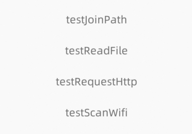

# JSAPI-如何编译

  Linux编译方法

### 下载代码

[📎jqutil-example-v4.zip.pdf](https://www.yuque.com/attachments/yuque/0/2023/pdf/1434115/1688042428435-88137554-4b0c-4be0-bc1c-b21f610a6996.pdf)

（上面代码下载之后，请将后缀pdf去掉，保留.zip 然后 进行解压，并导到你的开发IDE中）


代码目录如下：

```cpp
.
├── jsapi
│   ├── build                   // 编译目录
│   ├── iot-miniapp-sdk         // sdk 目录
│   │   ├── include             // sdk 的头文件
│   │   └── src                 // sdk 的库文件
│   └── src
│       └── jsapi_hello         // jsapi hello 示例
└── ui                          // IoT 小程序示例，用于测试 jsapi hello 模块
```

### 配置toolchain

如果是交叉编译环境需要设置toolchain，否则可跳过该步骤

打开 jsapi/CMakeLists.txt 文件

```cpp
# 设置工具链前缀比如 /usr/bin/arm-linux-gnueabihf-
set(CROSS_TOOLCHAIN_PREFIX "arm-linux-gnueabihf-")
set(CMAKE_C_COMPILER "${CROSS_TOOLCHAIN_PREFIX}gcc")
set(CMAKE_CXX_COMPILER "${CROSS_TOOLCHAIN_PREFIX}g++")
```

### 编译

进入编译目录，执行cmake 和 make命令即可

```bash
cd jsapi/build
cmake ..
make
```

编译输出 .so 文件

jsapi/build/libjsapi_hello.so

### 运行

1. 将 libjsapi_hello.so 拷贝到 /etc/miniapp/jsapis（**Linux默认为etc路径**） 目录下

```bash
/etc/miniapp/
└── jsapis
    └── libjsapi_hello.so  // 拷贝到这里
```

1. 用 IDE 打开 ui 目录，点击编译、推送按钮即可在设备上运行

如下为运行的界面，点击相应的按钮测试

