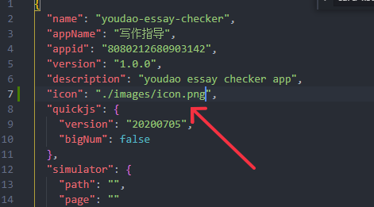

# updater-应用升级

  1. 概述

updater 模块用于检查应用升级情况，下载应用，升级应用

# 2. 模块使用方式

```javascript
import updater from 'updater'
```


# 3.方法

## 3.1 getUpdateInfo

检查应用升级情况

**入参**

异步接口：

| 属性     | 类型     | 必填 | 描述               |
| -------- | -------- | ---- | ------------------ |
| appid    | String   | 是   | 待检查appid。      |
| callback | Function | 否   | 检查后的回调函数。 |

callback参数：

| 属性        | 类型   | 必填 | 描述     |
| ----------- | ------ | ---- | -------- |
| checkResult | Object | 否   | 检查结果 |
| state       | int    | 是   | 当前状态 |

state 列表：

| 值                 | 含义                   |
| ------------------ | ---------------------- |
| ST_UP_TO_DATE      | 稳态，没有新的版本     |
| ST_CHECK_PENDING   | 中间态，正在检查版本   |
| ST_HAS_NEW_VERSION | 稳态，有新的版本       |
| ST_DOWNLOADING     | 中间态，正在下载       |
| ST_DOWNLOAD_DONE   | 稳态，下载完成等待安装 |
| ST_INSTALLING      | 中间态，正在安装       |
| ST_DOWNLOAD_PAUSED | 稳态，下载已暂停       |

```javascript
// 异步方法
updater.getUpdateInfo(appid, (updateInfo) => {
  console.log(`#######>> appid updateInfo ${JSON.stringify(updateInfo)}`)
  if (updateInfo.status === updater.ST_HAS_NEW_VERSION) {
    console.log(`可更新版本: ${updateInfo.checkResult.version} ${updateInfo.checkResult.desc}`)
  }
})

```

## 3.2 startDownload

下载应用包

**入参**

异步接口：

| 属性     | 类型     | 必填 | 描述          |
| -------- | -------- | ---- | ------------- |
| appid    | String   | 是   | 带下载包appid |
| callback | Function | 否   | 回调函数      |

callback参数：

| 属性   | 类型 | 必填 | 描述                                             |
| ------ | ---- | ---- | ------------------------------------------------ |
| result | int  | 是   | 下载结果                                         |
| reason | int  | 是   | 下载终止或暂停时对应的错误原因，见DownloadReason |

DownloadResult 列表：

| 属性名            | 含义                     |
| ----------------- | ------------------------ |
| DL_ERROR          | Deprecated 同 DL_ABORTED |
| DL_ABORTED        | 下载终止                 |
| DL_SUCCESS        | 下载完成                 |
| DL_ERROR_ON_GOING | 已经在下载               |
| DL_PAUSED         | 下载暂停                 |

DownloadReason 列表

| 属性名                             | 含义                                      |
| ---------------------------------- | ----------------------------------------- |
| DL_REASON_ABORT_INIT_ERROR         | 下载初始化失败导致下载终止                |
| DL_REASON_ABORT_URL_INACCESSIBLE   | 下载地址不可访问导致下载终止              |
| DL_REASON_ABORT_MD5_MISMATCH       | 下载文件的MD5与预期结果不匹配导致下载终止 |
| DL_REASON_ABORT_UNKNOWN            | 未知原因导致下载终止                      |
| DL_REASON_PAUSE_NETWORK_BROKEN     | 网络中断导致下载暂停                      |
| DL_REASON_PAUSE_INSUFFICIENT_SPACE | 系统空间不足导致下载暂停                  |
| DL_REASON_PAUSE_IO_EXCEPTION       | 内部存储读写错误导致下载暂停              |
| DL_REASON_PAUSE_UNKNOWN            | 未知原因导致下载暂停                      |

```javascript
// 异步接口
updater.startDownload(appInfo.appid, (info) => {
  console.log(`download cb ${JSON.stringify(info)}`)
  if (info.result === updater.DL_SUCCESS) {
    console.log('下载成功')
  } else if (info.result === updater.DL_PAUSED){
    if(info.reason === updater.DL_REASON_PAUSE_NETWORK_BROKEN){
      console.log('网络连接不佳，升级包下载已暂停')
    }
  }
})

```

## 3.3 installUpdate

安装已下载好的应用包

**入参**

异步接口：

| 属性     | 类型     | 必填 | 描述          |
| -------- | -------- | ---- | ------------- |
| appid    | String   | 是   | 待安装的appid |
| callback | Function | 否   | 回调函数      |

callback参数：

| 属性   | 类型 | 必填 | 描述     |
| ------ | ---- | ---- | -------- |
| result | int  | 是   | 安装结果 |

InstallResult 列表：

| 属性名                             | 含义                    |
| ---------------------------------- | ----------------------- |
| INS_ERROR_INSTALLATION             | 安装过程失败            |
| INS_ERROR_NO_INSTALL_PACKAGE       | 没有已下载的更新包      |
| INS_ERROR_INSTALL_ALREADY_ON_GOING | 已经在安装，重复调用    |
| INS_ERROR_NO_UPDATE_INFO           | 没有此appid的更新上下文 |
| INS_SUCCESS                        | 安装成功                |

```javascript
// 异步接口
updater.installUpdate(appInfo.appid, (info) => {
  console.log(`installUpdate cb ${JSON.stringify(info)}`)
  if (info.result === updater.INS_SUCCESS) {
    console.log('安装成功')
  }
})
```

## 3.4 on 事件

### 升级模块就绪事件

当升级模块准备就绪后，即触发此事件。

此外，当应用注册此事件监听时、升级模块已经处于就绪状态，则此回调会被立即调用。

注意：升级模块就绪前，调用 getUpdateInfo 会直接回调失败。

**事件名**

ready

**回调函数入参**

无

```javascript
updater.on("ready", ()=>{
    console.log("Updater is ready")
})
```

### 更新模块状态事件

**回调函数入参**

回调函数：

| 属性     | 类型     | 必填 | 描述         |
| -------- | -------- | ---- | ------------ |
| topic    | String   | 是   | 监听事件类型 |
| callback | Function | 是   | 监听回调     |

GloablEvent 列表：

| 属性名                      | 含义         |
| --------------------------- | ------------ |
| EVT_UPDATE_CHECK_PENDING    | 正在检查版本 |
| EVT_UPDATE_CHECK_ERROR      | 版本检查错误 |
| EVT_GOT_ALREADY_UP_TO_DATE  | 没有新版本   |
| EVT_GOT_NEW_VERSION         | 获取到新版本 |
| EVT_DOWNLOAD_PENDING        | 触发下载     |
| EVT_DOWNLOAD_PERCENT_CHANGE | 下载进度变化 |
| EVT_DOWNLOAD_ERROR          | 下载错误终止 |
| EVT_DOWNLOAD_DONE           | 下载完成     |
| EVT_INSTALLING              | 正在安装     |
| EVT_INSTALL_SUCCESS         | 安装成功     |
| EVT_INSTALL_ERROR           | 安装失败     |
| EVT_DOWNLOAD_PAUSED         | 下载暂停     |

```javascript
updater.on('updateInfo', ({event, info}) => {
  console.log(`updateInfo ${event} ${JSON.stringify(info)}`)
  // event: GlobalEvent
  // info: UpdateInfo
  if (event == updater.EVT_DOWNLOAD_PERCENT_CHANGE) {
    console.log(`应用安装进度：${info.appid} ${info.downloadPercent}`)
  }
})

```

## 3.5 isReady

判断升级模块是否就绪。

注意：升级模块就绪前，调用 getUpdateInfo 会直接回调失败。

#### 参数

无

#### 返回值

类型：bool

true：已就绪

false：未就绪

```javascript
if (updater.isReady()) {
    console.log("Updater is ready")
} else {
    console.log("Updater is NOT ready")
}
```

# icon配置



目前支持用相对路径和绝对路径，在vue里面可通过pm.getPackageInfo去获取amr的安装路径去加载图片，打包的图片都在amr的安装路径下面。
