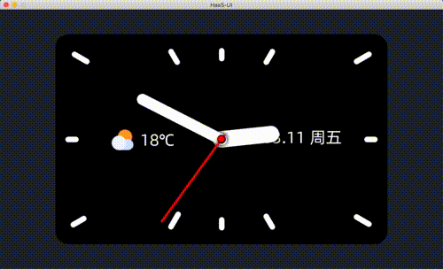

# 智能闹钟

## 展示效果

### gif 效果展示

### 示例代码下载 

[代码下载](https://iotx-haas-linkin.oss-cn-shanghai.aliyuncs.com/o/config/public-examples/haasui_smart_clock.zip)

### 简单讲解 

智能闹钟展示了闹钟绘制的常用方法：

1. 表盘绘制，通过 transform: rotate 旋转特性，绘制有圆角的矩形实现。

2. 表针绘制，通过摆放时、分、秒三个表针，通过 mvvm 动态特性修改三个指针的 transform: rotate 属性实现。

3. 绝对布局，针对浮动显示的天气 & 日期，通过 position:absolute 绝对布局浮动在相对于父容器的特定位置显示。

通过 setTimeout 事件驱动，不断改变mvvm变量， 从而动态改变表针、日期、天气等。