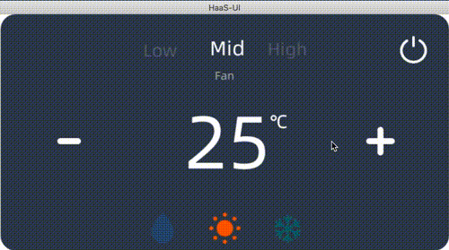

# 智能空调

## 展示效果

### gif 效果展示

### 示例代码下载

[代码下载](https://iotx-haas-linkin.oss-cn-shanghai.aliyuncs.com/o/config/public-examples/haasui_air_condition.zip)

## 简单讲解

智能空调展示了设备控制常用的 UI 定制方法：

1. 风速控制，是一个slider功能切换不同的选项
2. 温度控制，是两个按钮点击后切换一组数字，并且通过字体显示摄氏度符号
3. 模式控制，底部模式控制依然是一个slider切换不同选项
4. 开关浮层，是一个绝对布局带有蒙版效果的浮层，用于全局提示的交互