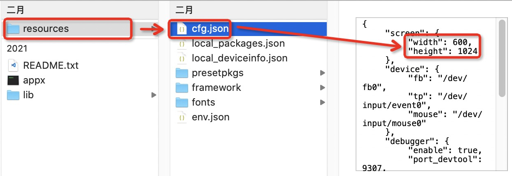

# **智能手表案例**

## 展示效果

### gif 效果展示

### 

### 示例代码下载

[下载](https://raw.githubusercontent.com/penosext/bs_haasui/refs/heads/master/haas-ui-watch.zip)

### 分辨率设置

推荐分辨率为240 x 320 (非该分辨率，可能存在部分页面显示错位问题，后续会修改)

- 设备端

参照[系统配置说明](https://www.yuque.com/wcye0k/haasui/athe1h)进行分辨率的设置

- [模拟器](app/simulator/intro)

修改模拟器根目录下的resources/cfg.json文件中的screen.width和screen.height属性

案例默认分辨率为 width 240， height 320

## 简单讲解

智能手表案例展示了手表中几种常见的操作效果(仅展示部分)：

1. 音乐，可进行音乐切换、音乐播放和音乐暂停操作。
2. 智能家居，包含智能灯泡和智能空调场景。
3. 天气，可显示最近一周某地的天气状况。
4. 设置，可调节屏幕亮度、更新系统版本。
5. 屏保壁纸，包含圆盘时钟和数字时钟。
