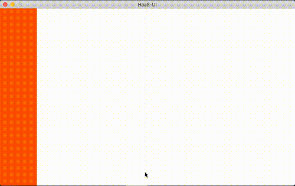

# 厂测案例

 

## 展示效果

### gif 效果展示

### 代码下载

[下载](https://raw.githubusercontent.com/penosext/bs_haasui/refs/heads/master/haasui_factory_test.zip)

## 简单讲解

该示例用于产测程序中触摸屏校验，可根据自身屏幕特征调整参数。

可修改参数：

- 设备宽高：修改 deviceWidth deviceHeight
- 触摸精度：修改 CHECK_精度px
- 配置更多测试条：steps
