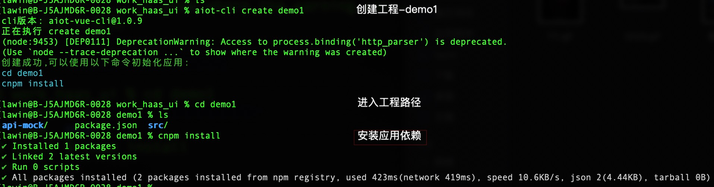
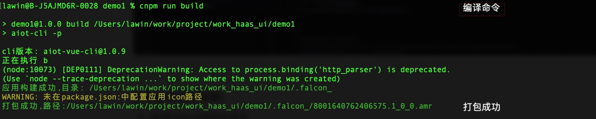

# 命令行工具

## 终端命令行方式

通过aiot-cli 和 npm命令进行应用创建、编译以及运行，支持的命令如下(安装见[链接](quick/env)：

| **命令**                     | **说明**      | **其他**                                                     |
| ---------------------------- | ------------- | ------------------------------------------------------------ |
| **aiot-cli create [name]**   | 创建应用工程  | 通过命令行创建应用新工程                                     |
| **cnpm run build**           | 编译Debug包   | 不会混淆JS文件，方便排查和调试，开发阶段推荐(性能会差 且 内存开销大) |
| **cnpm run build:prod**      | 编译Release包 | 会混淆JS文件，正式版推荐                                     |
| **cnpm run build:simulator** | 模拟器预览    | 电脑运行模拟器，如何运行见模拟器文档                         |

## 应用创建

aiot-cli create [name] #创建工程，name为你的工程名 

cd [name]              #进入到该工程的目录中 

cnpm install           #安装应用依赖

操作参考：

后面可以通过 VSCode编辑器 或 终端命令行操作 进行编译&运行

## 终端命令行操作

### 应用编译(打包构建)

- 在工程目录下面，输入编译命令
- 编译debug测试应用包

cnpm run build      #编译Debug测试应用包

- 编译release 正式应用包

cnpm run build:prod   #编译release 正式应用包

- 打包成功，同时会在工程路径下生成/.falcon_/ 文件资源，以及 /.falcon_/{appId}.amr应用包

## 模拟器运行

见[链接](app/simulator/intro)