# 开发插件

 

## 插件主要特性 

- 一键创建、编译 debug & Release 应用 
- 模拟器实时预览 (支持边修改代码边预览) 
- 应用一键更新至本地设备 

## 1、安装插件 

### 1.1 从应用商店安装 

在 VS Code 的插件市场中，搜索 Miniapp，选择IoT Miniapp点击安装即可 
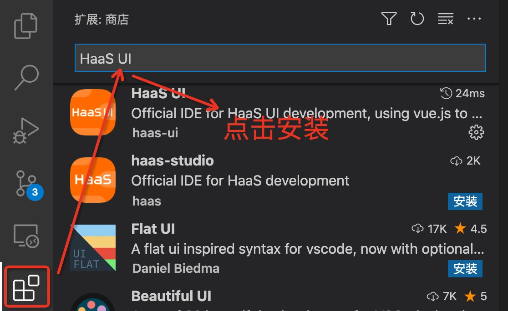 

## 2、搭建开发环境 

### 2.1 配置 aiot-vue-cli 

- aiot-vue-cli 安装教程详见[链接](quick/env) 
- 若 aiot-vue-cli 未安装，会在 vscode 下边栏提示需要激活插件，点击 “激活插件” 会在浏览器中弹出如何安装 aiot-vue-cli 的教程。  
- 重启 vscode 

## 3、创建工程 

### 3.1 配置框架工程创建路径 (可选) 

●插件设置中Workspace Path 用于配置框架工程的创建路径，配置后用户创建的应用工程，默认会放到 Workspace Pat 中。若不配置，会将创建的工程放到~/haasui-works 路径下  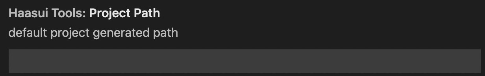

###  3.2 点击创建工程按钮 

点击 vscode 下边栏的 "+" 图标开始创建工程 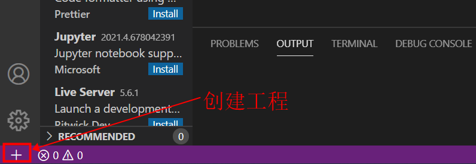 

### 3.3 输入项目名称 

按照实际项目名称命名即可 
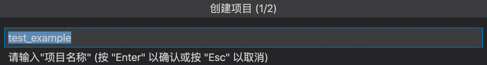 

### 3.4 输入项目路径 

工作区路径即为源码路径 (注：此目录名称必须为连续的英文字符) 

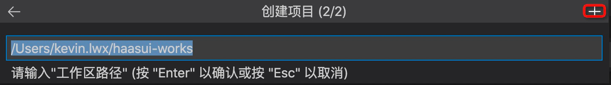

也可点击右上角的 “+” 号手动选择路径 

### 3.5 完成工程创建 

在工程路径输入完毕后，按回车键即可创建工程  

## 4、导入工程 

VsCode 工具栏 -> 文件 -> 打开文件夹 -> 选择要打开的工程 -> 点击打开即可 

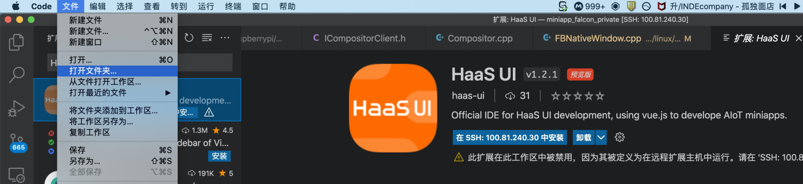

> Tip：导入已有工程，示例工程代码可以在入门案例中下载。 

## 5、编译工程 

### 5.1 编译 Debug 版本 

点击 Debug 版本的编译图标即可  

稍等片刻，就能看到编译结果，编译出来的 amr 包在应用的根路径下 

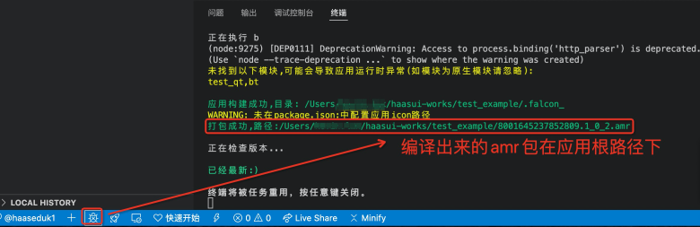

注：amr 包可以通过应用升级服务进行在线升级，具体见[应用升级](system_env_compile/update)服务推送给设备 

### 5.2 编译 Release 版本 

点击 Release 版本的编译图标即可 

稍等片刻，就能看到编译结果，编译出来的 amr 包在应用的根路径下 

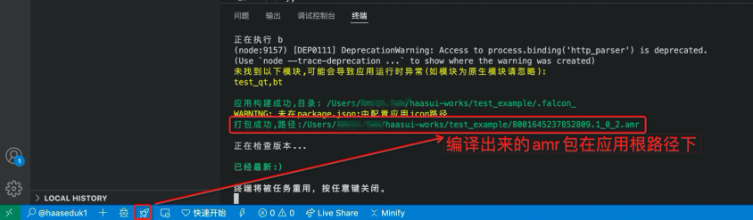

注：amr 包可以通过应用升级服务进行在线升级，具体见[应用升级](system_env_compile/update)服务推送给设备 

## 6、启动模拟器预览 

[详细见链接](app/simulator/intro) 

## 7、应用更新至设备 

[详细见链接](system_env_compile/update) 

## 8、异常情况列举 

**Windows 平台第一次 cnpm install 时间太长，模拟器一直在启动状态：：** 

  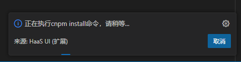	
  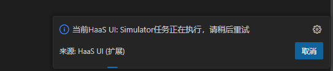

这两种情况都是由两个问题引起： 
**1.node 版本太低** 
解决方法：到 [http://nodejs.cn/download/](http://nodejs.cn/download/) 下载最新 nodejs 版本建议 v16+，目前最新 v18 + 也可以使用 
**2.powershell 权限受限** 
解决方法： 

1. 以管理员身份运行 PowerShell，如下 

   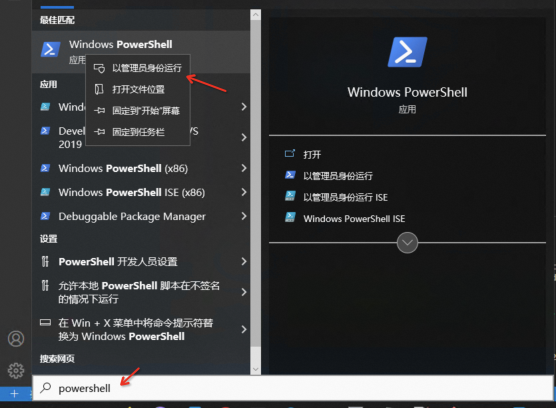

2. 在 PowerShell 终端输入如下命令开启权限 

   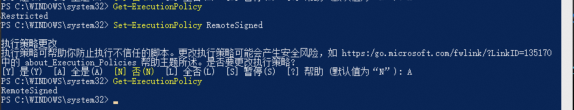