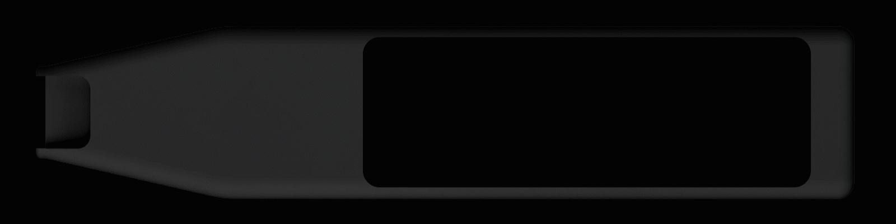
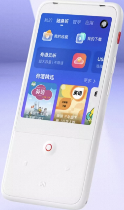
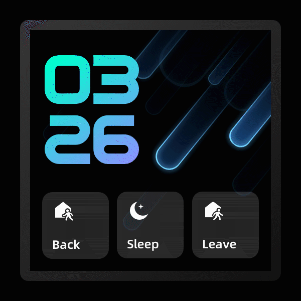
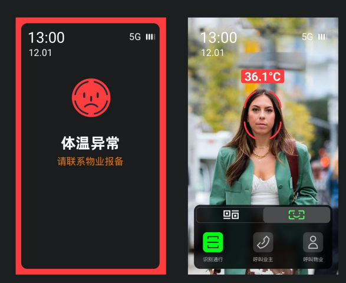
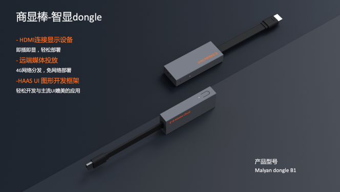

# **垂直产品演示效果**

### IoT带屏公板效果

 

具体请下载视频 ：[框架演示效果视频. mov](https://iotx-haas-linkin.oss-cn-shanghai.aliyuncs.com/o/config/haasui/mov/HaaS%20UI%20%E6%BC%94%E7%A4%BA%E6%95%88%E6%9E%9C%E8%A7%86%E9%A2%91.mov) 

## Chrome 浏览器体验 

公板 UI 效果，可以通过浏览器体验，[请点击网站](https://hli.aliyuncs.com/xyfolder/miniapp-wasm/index.html) 

## 词典笔 

 
[商业化客户 - 优学派词典笔](https://detail.tmall.com/item.htm?id=649656608352&rn=9f9ed71ade0aadb9f0df71102ff1c83f&abbucket=4) 
[商业化客户 - 有道词典笔](https://detail.tmall.com/item.htm?id=680368334196&skuId=4878596525113&user_id=3643428960&cat_id=2&is_b=1&rn=68b03b24e8a33674c65f5e2e8ad0b861) 

## 听力宝 

 

[商业化客户 - 有道听力宝](https://detail.tmall.com/item.htm?abbucket=1&id=666601380809&rn=3a5a2befecae663e6c7425f5974f0263&scene=taobao_shop&spm=a1z10.1-b-s.w5003-24933023705.3.679e58fdti8rfv) 

## 智能面板 

 

## 门禁监控 

 

(提供 Video 层与 UI 层的合成方案) 

`<hole></hole>挖洞显示视频层`

## 阿里云商显棒 Malyan Dongle 

 
 

(支持音视频播放) 
