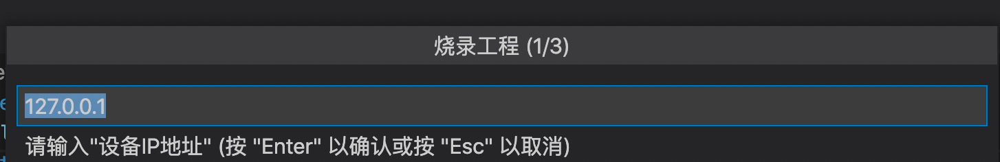
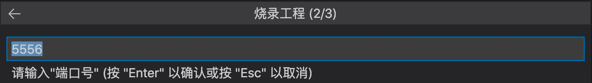
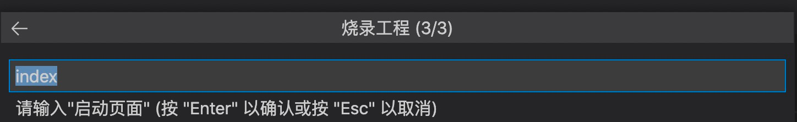

# 应用更新

真机一键更新，是指将开发好的应用包直接安装到设备(或模拟器)上以预览效果，避免重新刷机来预览效果，减少了应用安装和运行的难度

# 开启前提

#### 开启Debugger属性

在/etc/miniapp/resources/cfg.json中添加debugger属性

{ 	"debugger": { 		"enable": true 	} } 

#### CLI版本更新

- aiot-cli版本需要在1.0.6及以上
- 可通过sudo cnpm upload -g aiot-vue-cli@latest命令更新到最新版本
- aiot-cli check 可检查CLI版本

# 方案1 插件启动方式

在VSCode开发环境上，通过插件方式安装 & 启动应用，请确保设备已和电脑已连接至同一网段

- 注意：需要确保电脑和设备在同一个网段上(模拟器默认就是)，且5556的端口能访问(端口可以修改，模拟器默认打开的就是5556端口)

### 1.1 点击上传图标

首先点击上传图标

### 1.2 输入设备IP地址

在弹出来的对话框中，输入设备的IP地址，默认为127.0.0.1，可根据设备实际IP地址填入

Tip：**如果第二次点击未弹出设置IP地址，请重启一下VSCode，重新点击**

### 1.3 输入设备port号

在弹出来的对话框中，输入设备的port号，一般不用输入，用默认的5556即可

### 1.4 输入要启动的页面名称

在弹出来的对话框中，输入要启动的页面名称，一般不用输入，用默认的index即可

### 1.5 上传应用

在页面名称输入完毕后，按回车键即可上传编译好的应用至设备中

# 方案2 adb启动方式

需要系统支持adb能力，通过adb指令安装和启动应用

#### 步骤

- 推送amr包：adb push xxx.amr /tmp/xxx.amr
- 安装amr包：adb shell miniapp_cli install /tmp/xxx.amr
- 启动该应用：adb shell miniapp_cli start {appid} {page可选}
- 注意：amr包需要使用绝对路径

#### 示例

adb push .falcon_/8001234567890123.1_0_0.amr /tmp/app.amr adb shell miniapp_cli install /tmp/app.amr                  执行结果： install: {"appid": "8001234567890123", "payload": "{\"path\":\"/tmp/app.amr\"}", "ret": 0, "url": "/install"}	 adb shell miniapp_cli start 8001234567890123 	执行结果：  start: {"payload": "{\"appID\":\"8001234567890123\"}", "ret": 0, "url": "/start"}

# 方案3 设备&SD卡启动方式

对于无网络以及adb的终端设备，可以在设备上通过miniapp_cli指令安装和启动应用

#### 步骤

- 下载 or 推送amr包到设备（通过网络下载或者sd卡拷贝）
- 进入串口终端运行下列命令安装启动
- 安装amr包：miniapp_cli install /mnt/sdcard/xxx.amr
- 启动该应用：miniapp_cli start {appid} {page可选}
- 注意：amr包需要使用绝对路径